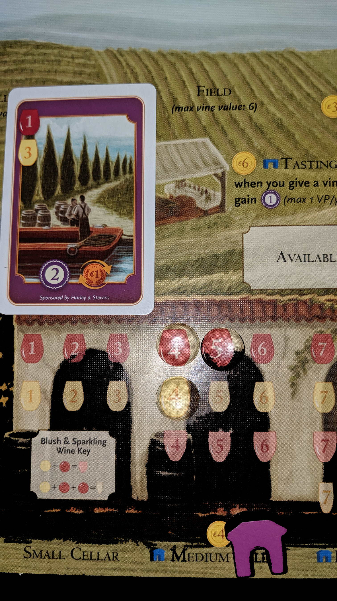

---?image=images/0.jpg&size=85% 85%&color=black

---

@snap[north-west span-50]
@color[red](How to Play) 
@color[blue](Tableu Builder.)
@ol[list-bullets-black](false)
- Roll dice to strengthen and expand your empire.
@olend

@snapend

@snap[north-east span-50]

@snapend

---

@snap[north-west span-50]
@color[red](Quick Terms: Workers) 
@color[blue](Dice.)
@ol[list-bullets-black](false)
@olend

@snapend

@snap[north-east span-50]

@snapend

---

@snap[north-west span-50]
@color[red](Quick Terms: Phase Strip) 
@color[blue](Identity Workers for pending Phases.)
@ol[list-bullets-black](false)
@olend

@snapend

@snap[north-east span-50]

@snapend

---

@snap[north-west span-50]
@color[red](Quick Terms) 
@color[blue](Phases)
@ol[list-bullets-black](false)
- Explore
- Develop
- Settle
- Produce
- Shipping
@olend

@snapend

@snap[north-east span-50]

@snapend

---

@snap[north-west span-50]
@color[red](Quick Terms: Citizenry) 
@color[blue](Used Workers.)
@ol[list-bullets-black](false)
@olend

@snapend

@snap[north-east span-50]

@snapend

---

@snap[north-west span-50]
@color[red](Quick Terms: Cup) 
@color[blue](Pending Workers.)
@ol[list-bullets-black](false)
@olend

@snapend

@snap[north-east span-50]

@snapend

---

@snap[north-west span-50]
@color[red](Quick Terms: Construction Zone) 
@color[blue](Queue of Developments or Worlds.)
@ol[list-bullets-black](false)
@olend

@snapend

@snap[north-east span-50]

@snapend

---

@snap[north-west span-50]
@color[red](Quick Terms: Faction Tiles) 
@color[blue](Starting Worlds or Developments)
@ol[list-bullets-black](false)
@olend

@snapend

@snap[north-east span-50]

@snapend

---

@snap[north-west span-50]
@color[red](Quick Terms: Developments) 
@color[blue](Bonuses per round.)
@ol[list-bullets-black](false)
@olend

@snapend

@snap[north-east span-50]

@snapend

---

@snap[north-west span-50]
@color[red](Quick Terms: Worlds) 
@color[blue](One time bonuses.)
@ol[list-bullets-black](false)
@olend

@snapend

@snap[north-east span-50]

@snapend

---

@snap[north-west span-50]
@color[red](Quick Terms: Consume) 
@color[blue](Goods turn into VP.)
@ol[list-bullets-black](false)
@olend

@snapend

@snap[north-east span-50]

@snapend

---

@snap[north-west span-50]
@color[red](Quick Terms: Trade) 
@color[blue](Goods turn into $)
@ol[list-bullets-black](false)
@olend

@snapend

@snap[north-east span-50]

@snapend

---

@snap[north-west span-50]
@color[red]() 
@color[blue](Round)
@ol[list-bullets-black](false)
- Roll
- Assign
- Reveal
- Phases
- Manage Empire
@olend

@snapend

@snap[north-east span-50]

@snapend

---

@snap[north-west span-50]
@color[red](Round) 
@color[blue](Roll)
@ol[list-bullets-black](false)
- Simultaneously
- Behind Screen
- Roll all Workers from cup
@olend

@snapend

@snap[north-east span-50]

@snapend

---

@snap[north-west span-50]
@color[red](Round) 
@color[blue](Assign)
@ol[list-bullets-black](false)
- Behind Screen
- Assign Worker under Phase Strip.
@olend

@snapend

@snap[north-east span-50]

@snapend

---

@snap[north-west span-50]
@color[red](Round: Assign) 
@color[blue](Phase Selection)
@ol[list-bullets-black](false)
- Move any one worker to any Phase on strip.
- Only players selected phases will happen.
@olend

@snapend

@snap[north-east span-50]

@snapend

---

@snap[north-west span-50]
@color[red](Round: Assign) 
@color[blue](Reassign)
@ol[list-bullets-black](false)
- 'Reassign' Development power works once per round.
- All players may Reassign to Dictate.
@olend

@snapend

@snap[north-east span-50]

@snapend

---

@snap[north-west span-50]
@color[red](Round: Assign) 
@color[blue](Dicate)
@ol[list-bullets-black](false)
- Dictate 'is' beside phase strip
- After assigning a Worker to Dictate, reassign a different Worker to any Phase.
@olend

@snapend

@snap[north-east span-50]

@snapend

---

@snap[north-west span-50]
@color[red](Round) 
@color[blue](Reveal)
@ol[list-bullets-black](false)
- Lift Screen
- Flip chosen Phase tiles from 'X'.
@olend

@snapend

@snap[north-east span-50]

@snapend

---

@snap[north-west span-50]
@color[red](Round: Reveal) 
@color[blue](Return)
@ol[list-bullets-black](false)
- Retun 'X' phase workers to cup.
- Return Dictate workers to cup.
@olend

@snapend

@snap[north-east span-50]

@snapend

---

@snap[north-west span-50]
@color[red](Round) 
@color[blue](Phases)
@ol[list-bullets-black](false)
- Execute each Phase step in order.
- Use all assinged Workers.
- Also use Worker who selected your Phase.
@olend

@snapend

@snap[north-east span-50]

@snapend

---

@snap[north-west span-50]
@color[red](Round: Phases) 
@color[blue]()
@ol[list-bullets-black](false)
- Explore
- Develop
- Settle
- Produce
- Shipping
@olend

@snapend

@snap[north-east span-50]

@snapend

---

@snap[north-west span-50]
@color[red](Round: Phases) 
@color[blue](Explore)
@ol[list-bullets-black](false)
- Scout or Stock.
- Move Worker to Citizenry.
@olend

@snapend

@snap[north-east span-50]

@snapend

---

@snap[north-west span-50]
@color[red](Round: Phases: Explore) 
@color[blue](Scout)
@ol[list-bullets-black](false)
- Optionally abandon Construction Zone tiles.
- Draw abandoned + 1 tiles from the bag.
- Place it as a Development or World Construction Zone.
@olend

@snapend

@snap[north-east span-50]

@snapend

---

@snap[north-west span-50]
@color[red](Round: Phases: Explore: Scout: Abandon) 
@color[blue](Any tile from Construction Zone.)
@ol[list-bullets-black](false)
- Put abandoned tile to side.
- Keep Workers on stack.
- Don't Develop or Settle completed tiles.
- After Explore phase, return abandoned tiles to bag.
@olend

@snapend

@snap[north-east span-50]

@snapend

---

@snap[north-west span-50]
@color[red](Round: Phases: Explore) 
@color[blue](Stock)
@ol[list-bullets-black](false)
- Get $2
@olend

@snapend

@snap[north-east span-50]

@snapend

---

@snap[north-west span-50]
@color[red](Round: Develop) 
@color[blue](Developments give round benefits.)
@ol[list-bullets-black](false)
- Mandatory unless 'May'
- Put Worker on Development Construction Zone stack.
- Complete if Workers = Cost of top Development.
@olend

@snapend

@snap[north-east span-50]

@snapend

---

@snap[north-west span-50]
@color[red](Round: Develop: Complete) 
@color[blue](May complete more than 1 tile.)
@ol[list-bullets-black](false)
- Move tile to tableu.
- Move Workers to Citizenry.
- Continue with Develop Workers
- Unusable Workers to cup.
@olend

@snapend

@snap[north-east span-50]

@snapend

---

@snap[north-west span-50]
@color[red](Round: Settle) 
@color[blue](Worlds will have immediate effect.)
@ol[list-bullets-black](false)
- Put worker on World Construction Zone stack.
- Complete if Workers = Cost of World.
@olend

@snapend

@snap[north-east span-50]

@snapend

---

@snap[north-west span-50]
@color[red](Round: Settle) 
@color[blue](Complete)
@ol[list-bullets-black](false)
- Move tile to tableu.
- Move Workers to Citizenry.
- Continue with Settle Workers.
- If effect removes dice, select from any location.
@olend

@snapend

@snap[north-east span-50]

@snapend

---

@snap[north-west span-50]
@color[red](Round: Produce) 
@color[blue](Each Worker becomes 1 Good on a World.)
@ol[list-bullets-black](false)
- Matching World color only helps when Consumed, not Traded.
- World may hold 1 Worker.
- Unusable Workers return to Cup.
@olend

@snapend

@snap[north-east span-50]

@snapend

---

@snap[north-west span-50]
@color[red](Round: Shipping) 
@color[blue](Change Good into $ or VP.)
@ol[list-bullets-black](false)
- Move both Shipping and Goods Worker to the Citizenry.
- Purple dice is wild.
@olend

@snapend

@snap[north-east span-50]

@snapend

---

@snap[north-west span-50]
@color[red](Round: Shipping: Trade) 
@color[blue](Earn $ per Good.)
@ol[list-bullets-black](false)
- Income based on World color, not Worker color.
@olend

@snapend

@snap[north-east span-50]

@snapend

---

@snap[north-west span-50]
@color[red](Round: Shipping: Consume) 
@color[blue](Earn VP.)
@ol[list-bullets-black](false)
- 1VP for Good.
- +1VP for Good matching World color.
- +1VP for Shipper matching World color.
@olend

@snapend

@snap[north-east span-50]

@snapend

---

@snap[north-west span-50]
@color[red](Round: Shipping: Consume) 
@color[blue](Trigger EOG)
@ol[list-bullets-black](false)
- If there aren't enough VP tokens, use the previously set aside 10VP.
@olend

@snapend

@snap[north-east span-50]

@snapend

---

@snap[north-west span-50]
@color[red](Round: Manage Empire) 
@color[blue](End of Round)
@ol[list-bullets-black](false)
- Recruiting
- Recall
- Reset
- Check EOG
@olend

@snapend

@snap[north-east span-50]

@snapend

---

@snap[north-west span-50]
@color[red](Round: Manage Empire) 
@color[blue](Recruit)
@ol[list-bullets-black](false)
- $1 to recruit Workers from Citizenry to Cup.
- If broke after recruit, +$1
@olend

@snapend

@snap[north-east span-50]

@snapend

---

@snap[north-west span-50]
@color[red](Round: Manage Empire) 
@color[blue](Recall)
@ol[list-bullets-black](false)
- Freely return any Construction Zone Worker to cup.
@olend

@snapend

@snap[north-east span-50]

@snapend

---

@snap[north-west span-50]
@color[red](Round: Manage Empire) 
@color[blue](Reset)
@ol[list-bullets-black](false)
- Flip active Phase tiles back to 'X'.
@olend

@snapend

@snap[north-east span-50]

@snapend

---

@snap[north-west span-50]
@color[red](Round: Manage Empire) 
@color[blue](Check EOG)
@ol[list-bullets-black](false)
- VP pool was exhausetd
- Player has 12 tiles in tableu.
@olend

@snapend

@snap[north-east span-50]

@snapend

---

@snap[north-west span-50]
@color[red](Winner: Most VP) 
@color[blue](Add up...)
@ol[list-bullets-black](false)
- VP Tokens
- VP for completed developments and worlds.
- VP from 6-Cost developments rewards (rounding up).
@olend

@snapend

@snap[north-east span-50]

@snapend

---

@snap[north-west span-50]
@color[red](Winner: Ties) 
@color[blue](Number of dice in cup + Money)
@ol[list-bullets-black](false)
@olend

@snapend

@snap[north-east span-50]

@snapend

---

@snap[north-west span-50]
@color[red](Winner) 
@color[blue](The End.)
@ol[list-bullets-black](false)
- 
