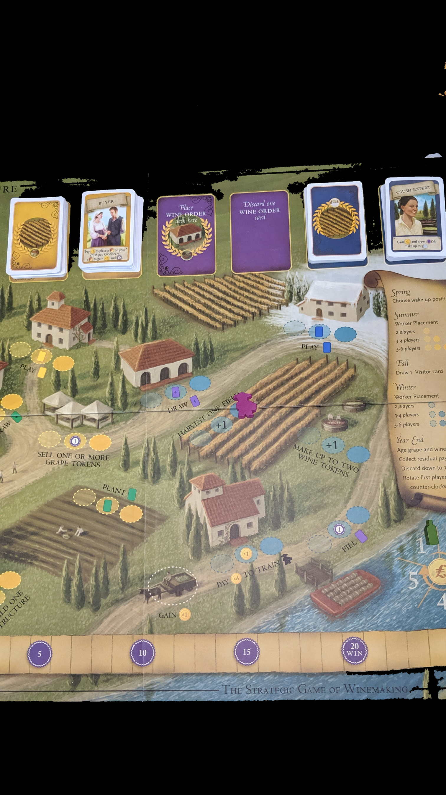

---?image=images/0.jpg&size=85% 85%&color=black

---

@snap[north-west span-50]
@color[red](How to Play) 
@color[blue](Roll dice to strengthen and expand your empire.)
@ol[list-bullets-black](false)
@olend

@snapend

@snap[north-east span-50]

@snapend

---

@snap[north-west span-50]
@color[red](Quick Terms: Workers) 
@color[blue](Dice.)
@ol[list-bullets-black](false)
@olend

@snapend

@snap[north-east span-50]

@snapend

---

@snap[north-west span-50]
@color[red](Quick Terms: Phase Strip) 
@color[blue](Manages Workers per Phase)
@ol[list-bullets-black](false)
- 5 phases
- Explore
- Develop
- Settle
- Produce
- Shipping
@olend

@snapend

@snap[north-east span-50]

@snapend

---

@snap[north-west span-50]
@color[red](Quick Terms: Citizenry) 
@color[blue](Used Workers.)
@ol[list-bullets-black](false)
@olend

@snapend

@snap[north-east span-50]

@snapend

---

@snap[north-west span-50]
@color[red](Quick Terms: Cup) 
@color[blue](Pending Workers.)
@ol[list-bullets-black](false)
@olend

@snapend

@snap[north-east span-50]

@snapend

---

@snap[north-west span-50]
@color[red](Quick Terms: Construction Zone) 
@color[blue](Queue of Developments or Worlds.)
@ol[list-bullets-black](false)
@olend

@snapend

@snap[north-east span-50]

@snapend

---

@snap[north-west span-50]
@color[red](Quick Terms: Credits) 
@color[blue](Money.)
@ol[list-bullets-black](false)
@olend

@snapend

@snap[north-east span-50]

@snapend

---

@snap[north-west span-50]
@color[red](Quick Terms: Faction Tiles) 
@color[blue](Starting World/Developments)
@ol[list-bullets-black](false)
@olend

@snapend

@snap[north-east span-50]

@snapend

---

@snap[north-west span-50]
@color[red](Quick Terms: Game Tiles) 
@color[blue](Development and World sides.)
@ol[list-bullets-black](false)
@olend

@snapend

@snap[north-east span-50]

@snapend

---

@snap[north-west span-50]
@color[red](Quick Terms: Consume) 
@color[blue](Goods turn into VP.)
@ol[list-bullets-black](false)
@olend

@snapend

@snap[north-east span-50]

@snapend

---

@snap[north-west span-50]
@color[red](Quick Terms: Trade) 
@color[blue](Goods turn into $)
@ol[list-bullets-black](false)
@olend

@snapend

@snap[north-east span-50]

@snapend

---

@snap[north-west span-50]
@color[red](Round) 
@color[blue](5 Steps)
@ol[list-bullets-black](false)
- Roll
- Assign
- Reveal
- Action
- Manage
@olend

@snapend

@snap[north-east span-50]

@snapend

---

@snap[north-west span-50]
@color[red](Roll) 
@color[blue](Roll)
@ol[list-bullets-black](false)
- Simultaneously
- Behind Screen
- Roll all Workers from cup
@olend

@snapend

@snap[north-east span-50]

@snapend

---

@snap[north-west span-50]
@color[red](Assign) 
@color[blue](Assign Worker under phase strip.)
@ol[list-bullets-black](false)
@olend

@snapend

@snap[north-east span-50]

@snapend

---

@snap[north-west span-50]
@color[red](Phase Selection) 
@color[blue](Select a Phase.)
@ol[list-bullets-black](false)
- Only players selected phases will happen.
- Move any one worker to any Phase on strip.
@olend

@snapend

@snap[north-east span-50]

@snapend

---

@snap[north-west span-50]
@color[red](Reassign) 
@color[blue](If developed, reassign workers to different phase.)
@ol[list-bullets-black](false)
- Reassign power works once per round.
- All players may Reassign to Dictate
@olend

@snapend

@snap[north-east span-50]

@snapend

---

@snap[north-west span-50]
@color[red](Dicate) 
@color[blue](Dictate "is" beside phase strip)
@ol[list-bullets-black](false)
- Reassign a different worker to a different phase.
- Dictated worker will end up in the cup.
@olend

@snapend

@snap[north-east span-50]

@snapend

---

@snap[north-west span-50]
@color[red](Reveal) 
@color[blue](Lift Screen)
@ol[list-bullets-black](false)
- Flip chosen Phase tiles.
@olend

@snapend

@snap[north-east span-50]

@snapend

---

@snap[north-west span-50]
@color[red](Return) 
@color[blue](Retun 'X' phase workers to cup.)
@ol[list-bullets-black](false)
- Return Dictate workers to cup.
@olend

@snapend

@snap[north-east span-50]

@snapend

---

@snap[north-west span-50]
@color[red](Phases (General)) 
@color[blue](In order execute each phase step.)
@ol[list-bullets-black](false)
- Use all assinged workers.
- Also use phase selection worker.
@olend

@snapend

@snap[north-east span-50]

@snapend

---

@snap[north-west span-50]
@color[red](Phases (List)) 
@color[blue](1. Explore)
@ol[list-bullets-black](false)
- 2. Develop
- 3. Settle
- 4. Produce
- 5. Shipping
@olend

@snapend

@snap[north-east span-50]

@snapend

---

@snap[north-west span-50]
@color[red](1. Explore) 
@color[blue](Either Scout or Stock.)
@ol[list-bullets-black](false)
- Move to Citizenry.
@olend

@snapend

@snap[north-east span-50]

@snapend

---

@snap[north-west span-50]
@color[red](SCOUT (or Stock)) 
@color[blue](Optionally abandon construction zone tiles.)
@ol[list-bullets-black](false)
- Draw 1 more tile than abandoned from the bag.
- Choose Development or World side.
- Place it in the construction zone.
@olend

@snapend

@snap[north-east span-50]

@snapend

---

@snap[north-west span-50]
@color[red](Abandon) 
@color[blue](Any tile from construction zone.)
@ol[list-bullets-black](false)
- Put abandoned tile under Explore Phase tile.
- After Explore phase return abandoned tiles to bag.
- Keep developers and settlers on stack.
- If developers complete a tile, don't complete until Develop/Settle phase.
@olend

@snapend

@snap[north-east span-50]

@snapend

---

@snap[north-west span-50]
@color[red]((Scout or) STOCK) 
@color[blue](Get $2)
@ol[list-bullets-black](false)
@olend

@snapend

@snap[north-east span-50]

@snapend

---

@snap[north-west span-50]
@color[red](2. Develop) 
@color[blue](Put worker on development construction zone stack.)
@ol[list-bullets-black](false)
- Developments will have mandatory actions (unless 'May')
- Complete if Workers = Cost of top development.
@olend

@snapend

@snap[north-east span-50]

@snapend

---

@snap[north-west span-50]
@color[red](2. Develop: Complete) 
@color[blue](Move tile to tableu.)
@ol[list-bullets-black](false)
- Move workers to Citizenry.
- Continue with Develop Workers
- May complete another tile.
- If construction zone is empty, return Worker to cup.
@olend

@snapend

@snap[north-east span-50]

@snapend

---

@snap[north-west span-50]
@color[red](3. Settle) 
@color[blue](Put worker on world construction zone stack.)
@ol[list-bullets-black](false)
- Worlds will have immediate effect.
- If effect removes dice, select any location.
- Complete if Workers = Cost of World.
@olend

@snapend

@snap[north-east span-50]

@snapend

---

@snap[north-west span-50]
@color[red](3. Settle: Complete) 
@color[blue](Move tile to tablue.)
@ol[list-bullets-black](false)
- Move Workers to Citizenry.
- Continue with Settle Workers.
@olend

@snapend

@snap[north-east span-50]

@snapend

---

@snap[north-west span-50]
@color[red](4. Produce) 
@color[blue](Each Worker becomes 1 good on non-gray World.)
@ol[list-bullets-black](false)
- Any color worker becomes a good.
- Matching world color applies to Consume.
- World may hold 1 good.
- Unusable Workers return to cup.
@olend

@snapend

@snap[north-east span-50]

@snapend

---

@snap[north-west span-50]
@color[red](5. Shipping) 
@color[blue](Each Worker Trades or Consumes a good.)
@ol[list-bullets-black](false)
- Both Ship and Good Worker move to Citizenry.
- Purple dice is wild.
@olend

@snapend

@snap[north-east span-50]

@snapend

---

@snap[north-west span-50]
@color[red](5. Shipping: Trade) 
@color[blue](Earn $ based on World color.)
@ol[list-bullets-black](false)
@olend

@snapend

@snap[north-east span-50]

@snapend

---

@snap[north-west span-50]
@color[red](5. Shipping: Consume) 
@color[blue](Earn VP.)
@ol[list-bullets-black](false)
- 1VP for good.
- +1VP for matching good color.
- +1VP for Shipper matching world color.
- If there aren't enough VP tokens, use the set aside 10VP. Trigger EOG.
@olend

@snapend

@snap[north-east span-50]

@snapend

---

@snap[north-west span-50]
@color[red](Manage Empire (EOR)) 
@color[blue](Recruiting)
@ol[list-bullets-black](false)
- Recall
- Reset
- Check OEG
@olend

@snapend

@snap[north-east span-50]

@snapend

---

@snap[north-west span-50]
@color[red](Manage Empire (EOR): Recruit) 
@color[blue](Recruit Workers from Citizenry per $)
@ol[list-bullets-black](false)
- After recruit if broke then +$1
@olend

@snapend

@snap[north-east span-50]

@snapend

---

@snap[north-west span-50]
@color[red](Manage Empire (EOR): Recall) 
@color[blue](Freely return any construction zone Worker to cup.)
@ol[list-bullets-black](false)
@olend

@snapend

@snap[north-east span-50]

@snapend

---

@snap[north-west span-50]
@color[red](Manage Empire (EOR): Reset) 
@color[blue](Flip Phase used Phase tiles back to 'X'.)
@ol[list-bullets-black](false)
@olend

@snapend

@snap[north-east span-50]

@snapend

---

@snap[north-west span-50]
@color[red](Manage Empire (EOR): Check EOG) 
@color[blue](A. VP pool was exhausetd)
@ol[list-bullets-black](false)
- B. Player has 12 tiles in tableu.
@olend

@snapend

@snap[north-east span-50]

@snapend

---

@snap[north-west span-50]
@color[red](Winner: Most VP) 
@color[blue](VP Tokens)
@ol[list-bullets-black](false)
- VP per completed developments and worlds.
- VP from 6-Cost developments rewards (rounding up).
@olend

@snapend

@snap[north-east span-50]

@snapend

---

@snap[north-west span-50]
@color[red](Winner: Ties) 
@color[blue](Most dice in cup + Money)
@ol[list-bullets-black](false)
- The End.
