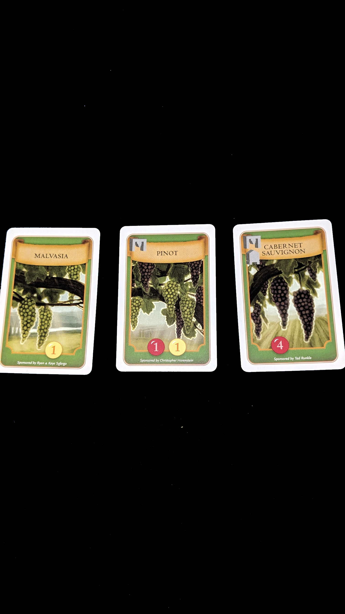
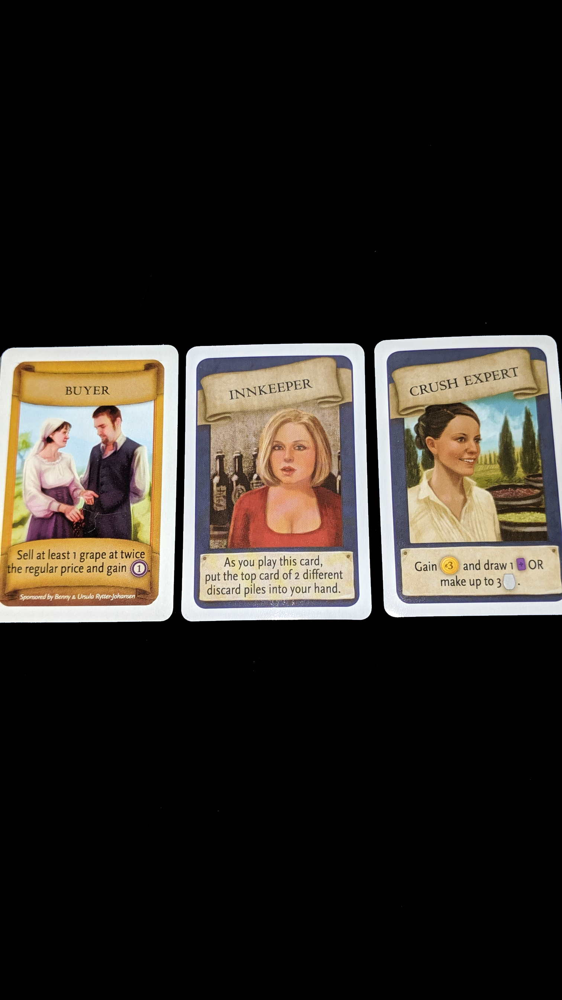
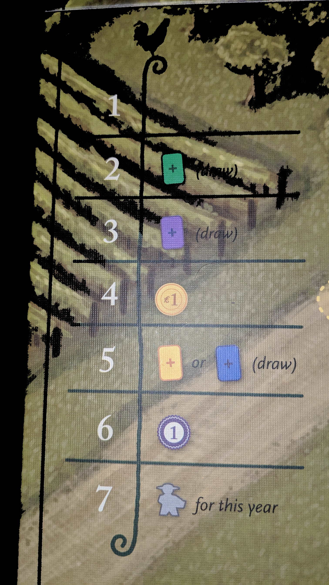
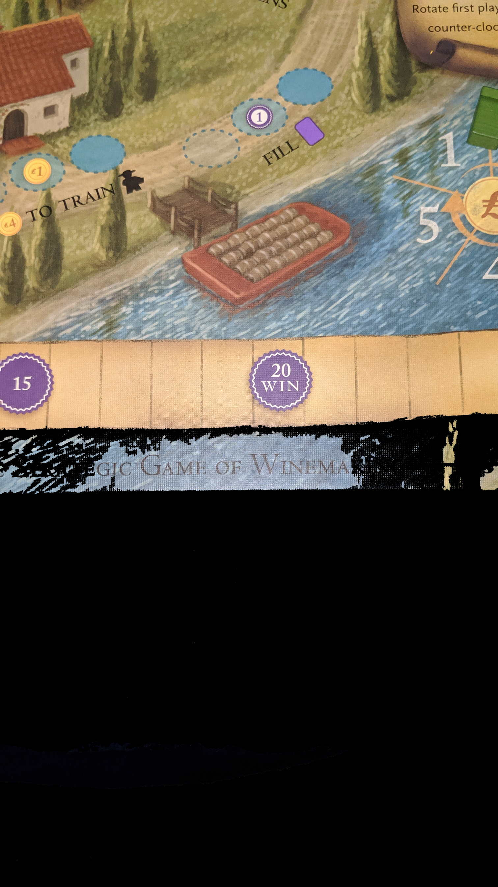

---?image=images/0.jpg&size=85% 85%&color=black

---

@snap[north-west span-50]
@color[red](How to Play) 
@color[blue](Domino Drafting/Builder.)
@ol[list-bullets-black](false)
- Pick dominos to add.
- VP from kingdom.
@olend

@snapend

@snap[north-east span-50]

@snapend

---

@snap[north-west span-50]
@color[red](Quick Terms:: Dominos) 
@color[blue](2 Terrains per.)
@ol[list-bullets-black](false)
- 7 distinct Terrains.
@olend

@snapend

@snap[north-east span-50]

@snapend

---

@snap[north-west span-50]
@color[red](Quick Terms:: Terrains) 
@color[blue](Yellow Fields.)
@ol[list-bullets-black](false)
- Dark Green Forests.
- Blue Lakes.
- Light Green Grasslands.
- Brown Swamps.
- Black Mines.
- Red Towns.
@olend

@snapend

@snap[north-east span-50]

@snapend

---

@snap[north-west span-50]
@color[red](Quick Terms:: Castle) 
@color[blue](Starting domino.)
@ol[list-bullets-black](false)
@olend

@snapend

@snap[north-east span-50]

@snapend

---

@snap[north-west span-50]
@color[red](Quick Terms:: King) 
@color[blue](You.)
@ol[list-bullets-black](false)
@olend

@snapend

@snap[north-east span-50]

@snapend

---

@snap[north-west span-50]
@color[red](Quick Terms:: Buildings) 
@color[blue](Get resources.)
@ol[list-bullets-black](false)
- Upgrade Territory.
@olend

@snapend

@snap[north-east span-50]

@snapend

---

@snap[north-west span-50]
@color[red](Quick Terms:: Builders Board) 
@color[blue](Price per building.)
@ol[list-bullets-black](false)
@olend

@snapend

@snap[north-east span-50]

@snapend

---

@snap[north-west span-50]
@color[red](Quick Terms:) 
@color[blue](Knights)
@ol[list-bullets-black](false)
@olend

@snapend

@snap[north-east span-50]

@snapend

---

@snap[north-west span-50]
@color[red](Quick Terms:) 
@color[blue](Towers)
@ol[list-bullets-black](false)
@olend

@snapend

@snap[north-east span-50]

@snapend

---

@snap[north-west span-50]
@color[red](Quick Terms:) 
@color[blue](Queen)
@ol[list-bullets-black](false)
@olend

@snapend

@snap[north-east span-50]

@snapend

---

@snap[north-west span-50]
@color[red](Quick Terms:) 
@color[blue](Dragon)
@ol[list-bullets-black](false)
@olend

@snapend

@snap[north-east span-50]

@snapend

---

@snap[north-west span-50]
@color[red](Quick Terms:: Coins) 
@color[blue](Money)
@ol[list-bullets-black](false)
@olend

@snapend

@snap[north-east span-50]

@snapend

---

@snap[north-west span-50]
@color[red](Actions) 
@color[blue](Place Domino.)
@ol[list-bullets-black](false)
- Place Knights.
- Construct Building.
- Bribe Dragon.
- Draft Domino
@olend

@snapend

@snap[north-east span-50]

@snapend

---

@snap[north-west span-50]
@color[red](Place Domino) 
@color[blue](A kingdom may not be more than 5x5 squares.)
@ol[list-bullets-black](false)
- at least two connecting squares must have the same terrain.
- the four sides of the starting domino are wild.
- once a Domino's placed it may not be moved.
- if you can't play a domino it's just discarded from the game.
- if they can be played they may not be discarded.
@olend

@snapend

@snap[north-east span-50]

@snapend

---

@snap[north-west span-50]
@color[red](Place Knights.) 
@color[blue](Optional)
@ol[list-bullets-black](false)
- Knights.
- Taxes.
@olend

@snapend

@snap[north-east span-50]

@snapend

---

@snap[north-west span-50]
@color[red](Place Knights.: Knights) 
@color[blue](If you have one or two Knights available.)
@ol[list-bullets-black](false)
- Place on current Domino.
- Collect Tax from Knight's Terrain.
@olend

@snapend

@snap[north-east span-50]

@snapend

---

@snap[north-west span-50]
@color[red](Place Knights.: Collect Tax) 
@color[blue]($ = connecting terrain squares.)
@ol[list-bullets-black](false)
- The knight will stay on the Square until the end of the game.
- You may place a Knight on a Terrain group where other Knights have collected taxes.
@olend

@snapend

@snap[north-east span-50]

@snapend

---

@snap[north-west span-50]
@color[red](Construct Buildings) 
@color[blue](Optional)
@ol[list-bullets-black](false)
- Buy Building
- Immediate Effects
- Game Effects
- Place Building
- VP Value
@olend

@snapend

@snap[north-east span-50]

@snapend

---

@snap[north-west span-50]
@color[red](Construct Buildings: Buy Building) 
@color[blue](Choose a building domino available on the Builders Board.)
@ol[list-bullets-black](false)
- Pay the bank the construction price.
@olend

@snapend

@snap[north-east span-50]

@snapend

---

@snap[north-west span-50]
@color[red](Construct Buildings: Immediate Effects) 
@color[blue](Top Left Grey Corner.)
@ol[list-bullets-black](false)
- Collect Knights, available next turn.
- Collect Towers, if most collect Queen.
@olend

@snapend

@snap[north-east span-50]

@snapend

---

@snap[north-west span-50]
@color[red](Construct Buildings: Game Effects) 
@color[blue](Lower Left Corner.)
@ol[list-bullets-black](false)
- When collecting tax.
- Per Knight, $ = total knights (placed or pending).
- Per Tower, $ = total towers.
@olend

@snapend

@snap[north-east span-50]

@snapend

---

@snap[north-west span-50]
@color[red](Construct Buildings: Place Building) 
@color[blue](Construct the building on an open Red Town.)
@ol[list-bullets-black](false)
- Upper Right Corner may add a crown.
@olend

@snapend

@snap[north-east span-50]

@snapend

---

@snap[north-west span-50]
@color[red](Construct Buildings: VP Value) 
@color[blue](Lower Right Corner)
@ol[list-bullets-black](false)
- EOG VP
- Flat VP
- VP per Terrain square.
- VP per Tower
- VP per Knight (placed or pending).
@olend

@snapend

@snap[north-east span-50]

@snapend

---

@snap[north-west span-50]
@color[red](Bribe Dragon) 
@color[blue](Optional)
@ol[list-bullets-black](false)
- bribe the dragon into burning a pending building.
- If the dragon's caved AND you aren't hosting the queen.
- Remove building domino from the builders board.
- Leave empty spot.
- Pay one coin.
@olend

@snapend

@snap[north-east span-50]

@snapend

---

@snap[north-west span-50]
@color[red](Draft Domino) 
@color[blue](Place King on available domino.)
@ol[list-bullets-black](false)
- Smallest value domino goes first next time.
@olend

@snapend

@snap[north-east span-50]

@snapend

---

@snap[north-west span-50]
@color[red](New Round) 
@color[blue](Send the dragon to the cave.)
@ol[list-bullets-black](false)
- Slide the building dominos to the cheapest spots.
- Form a new line of pending dominoes.
- Line them up numerically.
@olend

@snapend

@snap[north-east span-50]

@snapend

---

@snap[north-west span-50]
@color[red](EOG) 
@color[blue](Last 4 Domino's are used.)
@ol[list-bullets-black](false)
- All players take their final turn.
@olend

@snapend

@snap[north-east span-50]

@snapend

---

@snap[north-west span-50]
@color[red](Scoring) 
@color[blue](3$ = 1VP)
@ol[list-bullets-black](false)
- territories with crowns.
- every territory squares multiplied by the crowns.
- add up bonuses.
- ties broken by the largest territory group of matching terrains.
