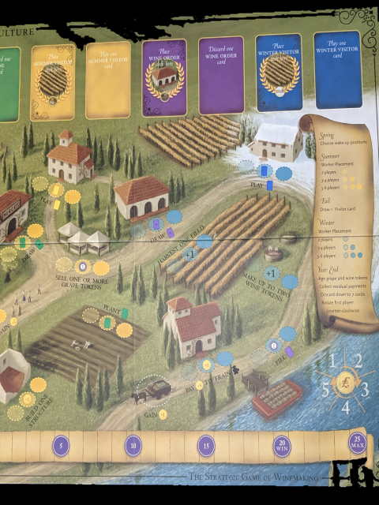

---?image=images/0.jpg&size=85% 85%&color=black

---

@snap[north-west span-50]
@color[red](Place Tiles.) 
@color[blue](Place 4 tiles in numerical order.)
@ol[list-bullets-black](false)
- Pick 1 tile.
- Smallest value tile goes first next time.
- Mandatory add your selected Domino to your kingdom
@olend

@snapend

@snap[north-east span-50]

@snapend

---

@snap[north-west span-50]
@color[red](Valid Placement) 
@color[blue](A kingdom may not be more than 5x5 squares.)
@ol[list-bullets-black](false)
- at least two connecting squares must have the same terrain.
- the four sides of the starting tile are wild.
- once a Domino's placed it may not be moved.
- if you can't play a tile it's just discarded from the game.
- if they can be played they may not be discarded.
@olend

@snapend

@snap[north-east span-50]

@snapend

---

@snap[north-west span-50]
@color[red](Knights) 
@color[blue](optional have one or two knights collect tax on a domino you just placed.)
@ol[list-bullets-black](false)
- if you have knights available you may choose to collect tax.
- start collecting the Domino **** knight and place it on the Domino immediately.
@olend

@snapend

@snap[north-east span-50]

@snapend

---

@snap[north-west span-50]
@color[red](Taxes) 
@color[blue](collect coin value equal to the number of connecting squares in the territory.)
@ol[list-bullets-black](false)
- the knight will stay on the Square until the end of the game.
- place up to two knights per turn.
- you may place a knight on a territory where other nights have been placed in previous rounds.
@olend

@snapend

@snap[north-east span-50]

@snapend

---

@snap[north-west span-50]
@color[red](Buildings) 
@color[blue](optional construct the building on open red construction Square.)
@ol[list-bullets-black](false)
- choose a building tile is available on the builders board.
- pay the bank the construction price.
- add the building to your construction Square.
@olend

@snapend

@snap[north-east span-50]

@snapend

---

@snap[north-west span-50]
@color[red](Earnings) 
@color[blue](collect the building bonus.)
@ol[list-bullets-black](false)
- make sure to remember any active building bonuses for future ****.
- you may only place one building per square.
@olend

@snapend

@snap[north-east span-50]

@snapend

---

@snap[north-west span-50]
@color[red](Dragon) 
@color[blue](optional bribe the dragon into burning a building tile.)
@ol[list-bullets-black](false)
- You can only take this action if
- the dragon is in the cave AND you are not hosting the queen.
- change city building tile from the builders board.
- pay one coin.
- burn the building discarding from the game.
- and **** with the dragon ****
- only one player per round can use the Dragon.
@olend

@snapend

@snap[north-east span-50]

@snapend

---

@snap[north-west span-50]
@color[red](Repeat Round: Place Tiles) 
@color[blue](mandatory select a new Domino and the next line with your king meeple.)
@ol[list-bullets-black](false)
@olend

@snapend

@snap[north-east span-50]

@snapend

---

@snap[north-west span-50]
@color[red](New Round) 
@color[blue](send the dragon to the cave.)
@ol[list-bullets-black](false)
- slide the building tiles to the cheapest spots.
- form a new line of dominoes.
- line them up numerically.
@olend

@snapend

@snap[north-east span-50]

@snapend

---

@snap[north-west span-50]
@color[red](EOG) 
@color[blue](last for Domino's or lined up all players take their final turn final.)
@ol[list-bullets-black](false)
@olend

@snapend

@snap[north-east span-50]

@snapend

---

@snap[north-west span-50]
@color[red](Scoring) 
@color[blue](3$ = 1VP)
@ol[list-bullets-black](false)
- territories with crowns.
- every territory squares multiplied by the crowns.
- add up bonuses.
- ties broken by the largest territory group of matching terrains.
