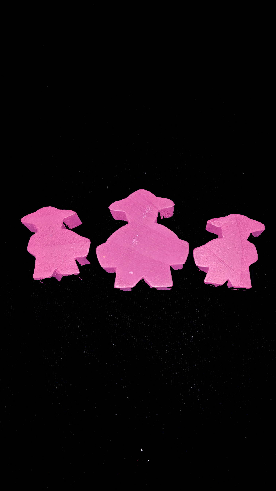

---?image=images/0.jpg&size=85% 85%&color=black

---

@snap[north-west span-50]
@color[red](Version) 
@color[blue](0.0.1)
@ol[list-bullets-black](false)
@olend

@snapend

@snap[north-east span-50]

@snapend

---

@snap[north-west span-50]
@color[red]() 
@color[blue](How to Play)
@ol[list-bullets-black](false)
@olend

@snapend

@snap[north-east span-50]

@snapend

---

@snap[north-west span-50]
@color[red](Quick Terms) 
@color[blue]()
@ol[list-bullets-black](false)
@olend

@snapend

@snap[north-east span-50]

@snapend

---

@snap[north-west span-50]
@color[red]() 
@color[blue](Phases)
@ol[list-bullets-black](false)
- Use Dice
- Attack
- Building and Trade
- EOT
- EOG
@olend

@snapend

@snap[north-east span-50]

@snapend

---

@snap[north-west span-50]
@color[red](Phases: Use Dice) 
@color[blue](For each dice take one action)
@ol[list-bullets-black](false)
@olend

@snapend

@snap[north-east span-50]

@snapend

---

@snap[north-west span-50]
@color[red](Phases: Use Dice) 
@color[blue](Actions)
@ol[list-bullets-black](false)
- Use the location beneath the die.
- Remove a die, and move another die left or right once.
- Remove a die, and repace 4 location cards. (Once per turn)
- Remove a die, and reactivate one location.
- Pass and get a Pass Token. (Once per turn)
- Optionally, use 2 Pass Tokens for one action. (As many times as you have Pass Tokens
@olend

@snapend

@snap[north-east span-50]

@snapend

---

@snap[north-west span-50]
@color[red](Phases: Use Dice: Actions) 
@color[blue](Gain one resource of your choice.)
@ol[list-bullets-black](false)
- +1 to your army strength (for the turn).
- Force all players to re-roll one die of your choice. (clockwise)
@olend

@snapend

@snap[north-east span-50]

@snapend

---

@snap[north-west span-50]
@color[red](Phases) 
@color[blue](Attack)
@ol[list-bullets-black](false)
- Army strength = Red locations sword values, which are activated with a die.
- May continue to attack with remaining strength.
@olend

@snapend

@snap[north-east span-50]

@snapend

---

@snap[north-west span-50]
@color[red](Phases: Attack: Actions) 
@color[blue](Attack Bandits.)
@ol[list-bullets-black](false)
- Attack Locations.
- Attack Stock.
@olend

@snapend

@snap[north-east span-50]

@snapend

---

@snap[north-west span-50]
@color[red](Phases: Attack: Actions) 
@color[blue](Attack Bandits)
@ol[list-bullets-black](false)
- Claim a Bandit Card where you have >= army strength.
- Place facedown in front of you.
@olend

@snapend

@snap[north-east span-50]

@snapend

---

@snap[north-west span-50]
@color[red](Phases: Attack: Actions) 
@color[blue](Attack Locations)
@ol[list-bullets-black](false)
- Place a Deactivation Token on an opponents city where you have >= army strength.
- Gain location's VP value (facedown).
- Can't attack already Deactivated locations.
- Can't attack locations without Defense Values.
@olend

@snapend

@snap[north-east span-50]

@snapend

---

@snap[north-west span-50]
@color[red](Phases: Attack: Actions) 
@color[blue](Attack Stock)
@ol[list-bullets-black](false)
- Per 2 strength, take an opponents resources.
@olend

@snapend

@snap[north-east span-50]

@snapend

---

@snap[north-west span-50]
@color[red](Phases: Attack: Building and Trade) 
@color[blue](Actions.)
@ol[list-bullets-black](false)
- Building.
- Trade.
@olend

@snapend

@snap[north-east span-50]

@snapend

---

@snap[north-west span-50]
@color[red](Phases: Attack: Building and Trade) 
@color[blue](Building)
@ol[list-bullets-black](false)
- Spend resources to buy available location.
- Place it over any city location.
- Replaced locations are nothing.
@olend

@snapend

@snap[north-east span-50]

@snapend

---

@snap[north-west span-50]
@color[red](Phases: Attack: Building and Trade) 
@color[blue](Trade)
@ol[list-bullets-black](false)
- Spend resources required for Trade Ship VP.
- Claim the Trade Ship facedown in front of you.
@olend

@snapend

@snap[north-east span-50]

@snapend

---

@snap[north-west span-50]
@color[red](Phases: Attack) 
@color[blue](EOT)
@ol[list-bullets-black](false)
- Keep one resource per type.
- Keep all Pass Tokens.
- Re-roll dice.
- Army strength reverts to 0.
@olend

@snapend

@snap[north-east span-50]

@snapend

---

@snap[north-west span-50]
@color[red](Phases: Attack: EOG) 
@color[blue](Continue until all players had the same amount of turns.)
@ol[list-bullets-black](false)
@olend

@snapend

@snap[north-east span-50]

@snapend

---

@snap[north-west span-50]
@color[red](Phases: Attack: EOG) 
@color[blue](Scenarios)
@ol[list-bullets-black](false)
- Three Bandit piles are exhausted.
- Two Trade Ship piles are exhausted.
- Empty Location deck.
@olend

@snapend

@snap[north-east span-50]

@snapend

---

@snap[north-west span-50]
@color[red](Phases: Attack: EOG: Optional Scenario) 
@color[blue](If you've upgraded two rows in your city - without deactication tokens - choose if you'd like to End the Game.)
@ol[list-bullets-black](false)
@olend

@snapend

@snap[north-east span-50]

@snapend

---

@snap[north-west span-50]
@color[red](Phases: Winning) 
@color[blue](Most VP from...)
@ol[list-bullets-black](false)
- VP Tokens.
- VP From Bandit or Trade Ships
- VP from city (include deactivated).
@olend

@snapend

@snap[north-east span-50]

@snapend

---

@snap[north-west span-50]
@color[red](Phases) 
@color[blue](Ties)
@ol[list-bullets-black](false)
- Ties broken by most location cards.
- Followed by VP from Bandit and Trade Ships.
- Followed by closest to starting player.
@olend

@snapend

@snap[north-east span-50]

@snapend

---

@snap[north-west span-50]
@color[red](Phases: ) 
@color[blue](Good luck.)
@ol[list-bullets-black](false)
