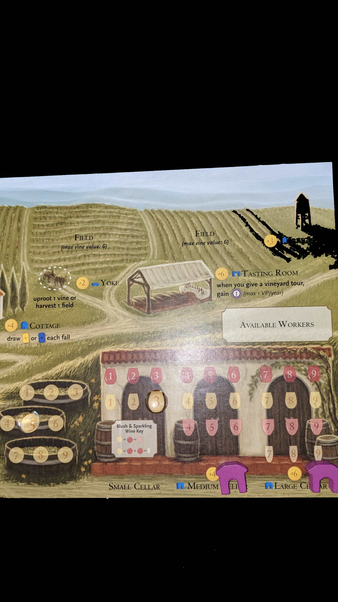
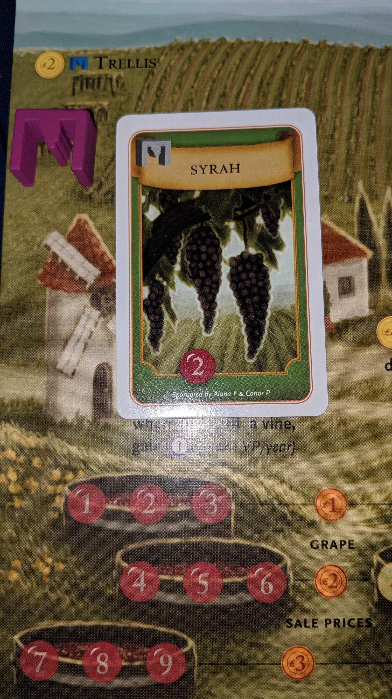
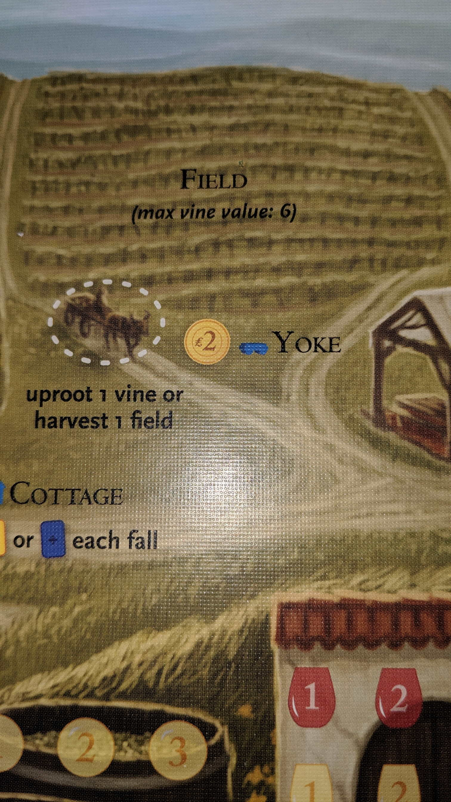
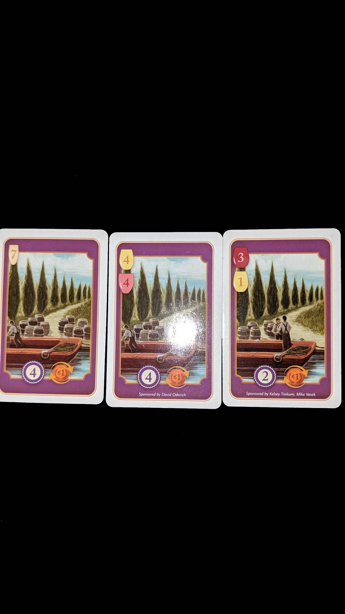
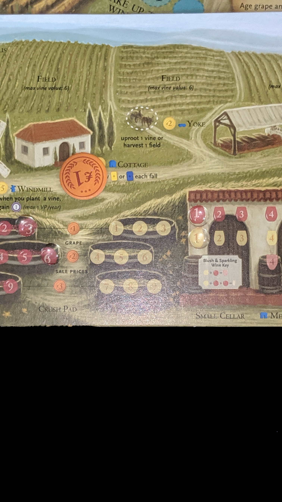

---?image=images/0.jpg&size=85% 85%&color=black

---

@snap[north-west span-50]
@color[red](Version) 
@color[blue](0.0.1)
@ol[list-bullets-black](false)
@olend

@snapend

@snap[north-east span-50]

@snapend

---

@snap[north-west span-50]
@color[red](How to Play) 
@color[blue](Through diplomacy and war become the strongest house in Westeros.)
@ol[list-bullets-black](false)
@olend

@snapend

@snap[north-east span-50]

@snapend

---

@snap[north-west span-50]
@color[red](Quick Terms:) 
@color[blue]()
@ol[list-bullets-black](false)
@olend

@snapend

@snap[north-east span-50]

@snapend

---

@snap[north-west span-50]
@color[red]() 
@color[blue](Phases)
@ol[list-bullets-black](false)
- Westeros
- Planning
- Action
@olend

@snapend

@snap[north-east span-50]

@snapend

---

@snap[north-west span-50]
@color[red](Phases) 
@color[blue](Westeros)
@ol[list-bullets-black](false)
- Advance Round Marker
- Draw Westeros Cards
- Advance Wildlings Track
- Resolve Westeros Cards
@olend

@snapend

@snap[north-east span-50]

@snapend

---

@snap[north-west span-50]
@color[red](Phases: Westeros: Advance Round Marker) 
@color[blue](Game ends after round 10.)
@ol[list-bullets-black](false)
@olend

@snapend

@snap[north-east span-50]

@snapend

---

@snap[north-west span-50]
@color[red](Phases: Westeros: Draw Westeros Cards) 
@color[blue](Reveal top card for all three decks.)
@ol[list-bullets-black](false)
- Wait
@olend

@snapend

@snap[north-east span-50]

@snapend

---

@snap[north-west span-50]
@color[red](Phases: Westeros: Advance Wildlings Track) 
@color[blue](Per Wildling Icon, advance track.)
@ol[list-bullets-black](false)
- Ignore any Icons moving it over 12.
- If at 12, immediatley resolve Wildling Attack.
@olend

@snapend

@snap[north-east span-50]

@snapend

---

@snap[north-west span-50]
@color[red](Phases: Westeros: Advance Wildlings Track: Wildling Attack) 
@color[blue](Wildling Strength = track number.)
@ol[list-bullets-black](false)
- Players siliently bid Power Tokens.
- Night's Watch wins if Power Tolens > Wilding Strength.
@olend

@snapend

@snap[north-east span-50]

@snapend

---

@snap[north-west span-50]
@color[red](Phases: Westeros: Advance Wildlings Track: Wildling Attack) 
@color[blue](Reset Wildling Track)
@ol[list-bullets-black](false)
- Return to 0 on Night's watch win.
- Move back 2 spaces on loss
@olend

@snapend

@snap[north-east span-50]

@snapend

---

@snap[north-west span-50]
@color[red](Phases: Westeros: Advance Wildlings Track: Wildling Attack) 
@color[blue](Reveal top Wildling card. Contains rewards or penalties.)
@ol[list-bullets-black](false)
- Night's Watch Victory reward goes to highest Power Bidder.
@olend

@snapend

@snap[north-east span-50]

@snapend

---

@snap[north-west span-50]
@color[red](Phases: Westeros: Resolve Westeros Cards) 
@color[blue](Resolve from deck 1-3)
@ol[list-bullets-black](false)
- Affects game/round
- May Supply, Muster, Clash of Kings
@olend

@snapend

@snap[north-east span-50]

@snapend

---

@snap[north-west span-50]
@color[red](Phases: Westeros: Resolve Westeros Cards: Resolve Westeros Cards) 
@color[blue](Supply)
@ol[list-bullets-black](false)
- In turn order. (or not for speed)
- Re-Defines how much army you can afford.
- Armies are 2+ units together.
- Move player barrel to match controlled supply icons.
@olend

@snapend

@snap[north-east span-50]

@snapend

---

@snap[north-west span-50]
@color[red](Phases: Westeros: Resolve Westeros Cards: Supply) 
@color[blue](Flags 4 / 3 / 2 / 2)
@ol[list-bullets-black](false)
- Show's you can have a 4 unit army
- Three unit army
- Two unit army
- Two unit army
- As many 1 units as you want.
@olend

@snapend

@snap[north-east span-50]

@snapend

---

@snap[north-west span-50]
@color[red](Phases: Westeros: Resolve Westeros Cards) 
@color[blue](Supply)
@ol[list-bullets-black](false)
- If you're now over a limit
- Remove units from board until you're valid.
@olend

@snapend

@snap[north-east span-50]

@snapend

---

@snap[north-west span-50]
@color[red](Phases: Westeros: Resolve Westeros Cards: Resolve Westeros Cards) 
@color[blue](Muster)
@ol[list-bullets-black](false)
- In turn order. (or not for speed)
- Recruit more unused units.
- No change, no savings.
@olend

@snapend

@snap[north-east span-50]

@snapend

---

@snap[north-west span-50]
@color[red](Phases: Westeros: Resolve Westeros Cards: Muster) 
@color[blue](Income)
@ol[list-bullets-black](false)
- Stronghold gives $2 on it.
- Castle gives $1 on it.
- Stay within Supply limits.
@olend

@snapend

@snap[north-east span-50]

@snapend

---

@snap[north-west span-50]
@color[red](Phases: Westeros: Resolve Westeros Cards: Muster) 
@color[blue](Costs)
@ol[list-bullets-black](false)
- Footman $1
- Knight $2, upgrade footman $1
- Ship $1, place in adjacent Port or Sea space.
- Siege Engine $2, upgrade footman $1
@olend

@snapend

@snap[north-east span-50]

@snapend

---

@snap[north-west span-50]
@color[red](Phases: Westeros: Resolve Westeros Cards: Resolve Westeros Cards) 
@color[blue](Clash of Kings)
@ol[list-bullets-black](false)
- Hide Power Tokens.
- Silently bid for order per track.
- Ties decided by owner of Iron Throne Token.
@olend

@snapend

@snap[north-east span-50]

@snapend

---

@snap[north-west span-50]
@color[red](Phases: Westeros: Resolve Westeros Cards) 
@color[blue](Clash of Kings)
@ol[list-bullets-black](false)
- Top to Bottom, earning Reward Token after each.
- Discard Used Power Tokens
- Place unused Power Tokens in front of screen.
@olend

@snapend

@snap[north-east span-50]

@snapend

---

@snap[north-west span-50]
@color[red](Phases: Westeros: Resolve Westeros Cards: Clash of Kings) 
@color[blue](Iron Throne Track)
@ol[list-bullets-black](false)
- Defines turn order.
- Reward Throne = all tie-breaking (not battles).
@olend

@snapend

@snap[north-east span-50]

@snapend

---

@snap[north-west span-50]
@color[red](Phases: Westeros: Resolve Westeros Cards: Clash of Kings) 
@color[blue](Fiefdom Track)
@ol[list-bullets-black](false)
- Order breaks tied battles.
- Reward Sword = +1 to one battle per round.
@olend

@snapend

@snap[north-east span-50]

@snapend

---

@snap[north-west span-50]
@color[red](Phases: Westeros: Resolve Westeros Cards: Clash of Kings) 
@color[blue](King's Court Track)
@ol[list-bullets-black](false)
- Defines how many *Special Order Tokens that are usable to you.
- Rewards Raven = Replace one Order Token
- OR Look at top Wildling Deck. Return to top or bottom.
@olend

@snapend

@snap[north-east span-50]

@snapend

---

@snap[north-west span-50]
@color[red](Phases: Planning) 
@color[blue](Assign)
@ol[list-bullets-black](false)
- Assign Order Tokens facedown.
- One per unit(s) controlled territory.
- *Special Order Tokens have stars.
@olend

@snapend

@snap[north-east span-50]

@snapend

---

@snap[north-west span-50]
@color[red](Phases: Planning: Order Tokens) 
@color[blue](Will resolve by token type.)
@ol[list-bullets-black](false)
- Raid
- March
- Defense
- Support
- Consolidate Power
@olend

@snapend

@snap[north-east span-50]

@snapend

---

@snap[north-west span-50]
@color[red](Phases: Planning: Order Tokens) 
@color[blue](Raid)
@ol[list-bullets-black](false)
- Remove adjacent Raid, Support, Consolidate Power
- *Special = or remove Defense.
@olend

@snapend

@snap[north-east span-50]

@snapend

---

@snap[north-west span-50]
@color[red](Phases: Planning: Order Tokens) 
@color[blue](March)
@ol[list-bullets-black](false)
- Per unit, move to adjacent territory.
- Triggers battle with enemy units.
- Only One pattle per token.
- *Special = +1 battle for attacker.
@olend

@snapend

@snap[north-east span-50]

@snapend

---

@snap[north-west span-50]
@color[red](Phases: Planning: Order Tokens) 
@color[blue](Defense)
@ol[list-bullets-black](false)
- Adds it's defense bonus in territory.
- As many times as it's attacked.
- *Special = +2 battle for defender.
@olend

@snapend

@snap[north-east span-50]

@snapend

---

@snap[north-west span-50]
@color[red](Phases: Planning: Order Tokens) 
@color[blue](Support)
@ol[list-bullets-black](false)
- Per unit, add's unit strength to adjacent territory.
- Support Attacker or Defender.
- *Special = +1 support value.
- May support your other territories.
@olend

@snapend

@snap[north-east span-50]

@snapend

---

@snap[north-west span-50]
@color[red](Phases: Planning: Order Tokens) 
@color[blue](Consolidate Power)
@ol[list-bullets-black](false)
- Gain 1 Power Token.
- +1 per power icon of territory.
- *Special = OR muster the territory.
- Nothing for seas, but misdirection.
@olend

@snapend

@snap[north-east span-50]

@snapend

---

@snap[north-west span-50]
@color[red](Phases: Planning) 
@color[blue](Once order tokens are placed.)
@ol[list-bullets-black](false)
- Reveal
- Use Raven, once per round.
@olend

@snapend

@snap[north-east span-50]

@snapend

---

@snap[north-west span-50]
@color[red](Phases: Planning: Raven) 
@color[blue](From King's Court Track)
@ol[list-bullets-black](false)
- Defines how many *Special Order Tokens that are usable to you.
- Rewards Raven = Replace one Order Token
- OR Look at top Wildling Deck. Return to top or bottom.
@olend

@snapend

@snap[north-east span-50]

@snapend

---

@snap[north-west span-50]
@color[red](Phases) 
@color[blue](Action)
@ol[list-bullets-black](false)
- Resolve one token per action.
- Play order = Iron Throne Track.
@olend

@snapend

@snap[north-east span-50]

@snapend

---

@snap[north-west span-50]
@color[red](Phases) 
@color[blue](Action)
@ol[list-bullets-black](false)
- Raid
- March
- Defense
- Support
- Consolidate Power
@olend

@snapend

@snap[north-east span-50]

@snapend

---

@snap[north-west span-50]
@color[red](Phases: Action) 
@color[blue](Raid)
@ol[list-bullets-black](false)
- Remove adjacent Raid, Support, Consolidate Power, (Defense with *Special).
- Remove Consolidate Power adds one Power Token, loser discards one Power Token.
- Land cannot Raid sea, Sea can Raid either.
- May choose to not resolve token.
@olend

@snapend

@snap[north-east span-50]

@snapend

---

@snap[north-west span-50]
@color[red](Phases: Action) 
@color[blue](March)
@ol[list-bullets-black](false)
- Per unit, move to adjacent territory.
- Resolve non-attacking units first.
- Resolve one battle last.
- Lose control if abandoning territory OR leave a Power Token.
- *Special = +1 battle for attacker.
@olend

@snapend

@snap[north-east span-50]

@snapend

---

@snap[north-west span-50]
@color[red](Phases: Action: March: Sword Token) 
@color[blue](From Fiefdom Track.)
@ol[list-bullets-black](false)
- Fiefdom Track Order breaks tied battles.
- Reward Sword = +1 to one battle per round.
@olend

@snapend

@snap[north-east span-50]

@snapend

---

@snap[north-west span-50]
@color[red](Phases: Action) 
@color[blue](Defense)
@ol[list-bullets-black](false)
- Adds it's defense bonus in territory.
- As many times as it's attacked.
- *Special = +2 battle for defender.
@olend

@snapend

@snap[north-east span-50]

@snapend

---

@snap[north-west span-50]
@color[red](Phases: Action) 
@color[blue](Support)
@ol[list-bullets-black](false)
- Add all units strength to adjacent territory.
- Support Attacker or Defender.
- *Special = +1 support value.
- Cannot support the Sword token.
- May support your other territories.
@olend

@snapend

@snap[north-east span-50]

@snapend

---

@snap[north-west span-50]
@color[red](Phases: Action) 
@color[blue](Consolidate Power)
@ol[list-bullets-black](false)
- Gain 1 Power Token.
- +1 per Power icon of territory.
- *Special = OR muster the territory.
- Nothing for seas, but misdirection.
@olend

@snapend

@snap[north-east span-50]

@snapend

---

@snap[north-west span-50]
@color[red](Phases: Action: Battles) 
@color[blue](Phases)
@ol[list-bullets-black](false)
- Call for support.
- Calculate initial Strengths.
- Choose and Reveal House Cards.
- Tides of Battle
- Winner has higher strength.
- Ties broken up by the Fiefdom Track order.
- Resolve Battle.
@olend

@snapend

@snap[north-east span-50]

@snapend

---

@snap[north-west span-50]
@color[red](Phases: Action: Battles) 
@color[blue](Call for support)
@ol[list-bullets-black](false)
- If vacating a terrirtory, optionally leave a Power Token to retain control.
- Request help from adjacent Support Tokens.
- Agreed ally gives full territory strength to one side.
- *Special token = +1 supported strength.
- Support Tokens can be reused for all adjacent battles.
@olend

@snapend

@snap[north-east span-50]

@snapend

---

@snap[north-west span-50]
@color[red](Phases: Action: Battles: Calculate initial Strengths) 
@color[blue](Strength = )
@ol[list-bullets-black](false)
- + Unit values.
- + Defense Order token.
- + March Order bonus/penalty.
- + Joined Support Territories.
- + Garrison tokens.
@olend

@snapend

@snap[north-east span-50]

@snapend

---

@snap[north-west span-50]
@color[red](Phases: Action: Battles: Calculate initial Strengths) 
@color[blue](Unit Strengths)
@ol[list-bullets-black](false)
- +1 Foot soldier.
- +1 Ship.
- +2 Knight.
- +0/4 Siege Engine
@olend

@snapend

@snap[north-east span-50]

@snapend

---

@snap[north-west span-50]
@color[red](Phases: Action: Battles: Calculate initial Strengths: Unit Strengths) 
@color[blue](Seige Engine)
@ol[list-bullets-black](false)
- +4 if attacking or supporting an attack against a Castle or Stronghold.
- OR +0
@olend

@snapend

@snap[north-east span-50]

@snapend

---

@snap[north-west span-50]
@color[red](Phases: Action: Battles: Choose and Reveal House Cards.) 
@color[blue](Choose and reveal one House Card.)
@ol[list-bullets-black](false)
- Cannot support a House Card.
@olend

@snapend

@snap[north-east span-50]

@snapend

---

@snap[north-west span-50]
@color[red](Phases: Action: Battles) 
@color[blue](Tides of Battle)
@ol[list-bullets-black](false)
- Draw Tides of Battle cards.
- May Use Sword token.
- Reveal Tides of Battle cards.
- Modify Casualities
@olend

@snapend

@snap[north-east span-50]

@snapend

---

@snap[north-west span-50]
@color[red](Phases: Action: Battles: Tides of Battle) 
@color[blue](Draw Tides of Battle cards)
@ol[list-bullets-black](false)
- Shuffle all Tides of Battle cards.
- Draw one card.
@olend

@snapend

@snap[north-east span-50]

@snapend

---

@snap[north-west span-50]
@color[red](Phases: Action: Battles: Tides of Battle) 
@color[blue](May Use Sword token)
@ol[list-bullets-black](false)
- Use the Sword token to discard and draw again.
- OR add +1 to battle strength.
- If used, flip until EOR.
@olend

@snapend

@snap[north-east span-50]

@snapend

---

@snap[north-west span-50]
@color[red](Phases: Action: Battles: Tides of Battle: Reveal Tides of Battle cards) 
@color[blue](+ Card Stength (Shield).)
@ol[list-bullets-black](false)
- = final strength.
- Most points, tieds broken by Fiefdom Track.
@olend

@snapend

@snap[north-east span-50]

@snapend

---

@snap[north-west span-50]
@color[red](Phases: Action: Battles: Tides of Battle) 
@color[blue](Modify Casualities)
@ol[list-bullets-black](false)
- Add Sword or Fortification icons to your played House Card.
- Resolve Sword or Fortification Icons.
- Resolve Skull icons.
@olend

@snapend

@snap[north-east span-50]

@snapend

---

@snap[north-west span-50]
@color[red](Phases: Action: Battles: Tides of Battle: Modify Casualities) 
@color[blue](Resolve Sword or Fortification Icons)
@ol[list-bullets-black](false)
- Defeated player takes casualties.
- Must destroy 1 unit per = attacker sword - forticication icons.
@olend

@snapend

@snap[north-east span-50]

@snapend

---

@snap[north-west span-50]
@color[red](Phases: Action: Battles: Tides of Battle: Modify Casualities) 
@color[blue](Resolve Skill Icons)
@ol[list-bullets-black](false)
- If either player's Tides of Battle card contained 1+ Skulls.
- Other player destroys 1 unit.
- From attacking force/defending territory.
- In addition to the loss from Sword Icons.
@olend

@snapend

@snap[north-east span-50]

@snapend

---

@snap[north-west span-50]
@color[red](Phases: Action: Battles: Tides of Battle) 
@color[blue](Retreats or Routing)
@ol[list-bullets-black](false)
- If Attacker lost, must retreat to attacking territory.
- If Defender lost, must reteat to...
@olend

@snapend

@snap[north-east span-50]

@snapend

---

@snap[north-west span-50]
@color[red](Phases: Action: Battles: Tides of Battle: Retreats or Routing) 
@color[blue](Defender Retreats)
@ol[list-bullets-black](false)
- An adjacent uncontrolled territory.
- Uncontrolled = no units or Power Tokens.
- Cannot retreat to Attackers terrirory.
- Retreating Units can't break Supply Limits.
- May use ships to transport a retreat.
- Siege Engines must be destroyed.
- Place retreated units on side to indicate 'Routed'
@olend

@snapend

@snap[north-east span-50]

@snapend

---

@snap[north-west span-50]
@color[red](Phases: Action: Battles: Tides of Battle: Retreats or Routing) 
@color[blue](Routed)
@ol[list-bullets-black](false)
- No more adding to battle strength.
- Doesn't join battle, so can't be destroyed as sword/skull icon penalty.
- Can't be moved
- Still counts against Supply Limits.
- A routed unit, later forced to retreat is destroyed.
@olend

@snapend

@snap[north-east span-50]

@snapend

---

@snap[north-west span-50]
@color[red](Phases: Action: Battles) 
@color[blue](Resolve Battle)
@ol[list-bullets-black](false)
- Attacker Wins, remove Attacked Order Token.
- Discard enemy Power Token marking control.
- Non-controlled territory immediately becomes original owner's territory again.
- Defender Wins, doesn't affect Attackers Tokens.
- Discard Played House Card.
- Continue with next Iron Throne Track Player Order, March Order
@olend

@snapend

@snap[north-east span-50]

@snapend

---

@snap[north-west span-50]
@color[red](Phases) 
@color[blue](EOR)
@ol[list-bullets-black](false)
- Stand up Routed units.
- Flip Sword and Raven Token to usable side.
- EOR 10, is the EOG.
- Always keep Victory Track instantly current.
@olend

@snapend

@snap[north-east span-50]

@snapend

---

@snap[north-west span-50]
@color[red](Phases) 
@color[blue](Winning)
@ol[list-bullets-black](false)
- Instantly when Player completes Victory Track.
- OR Highest Victory Track after 10 Rounds
- Ties broken my count of Strongholds.
- Else Ties broken by highest Supply Limit
- Else Ties broken by most Power tokens.
- Finally Ties broken by Iron Throne Track.
@olend

@snapend

@snap[north-east span-50]

@snapend

---

@snap[north-west span-50]
@color[red]() 
@color[blue](Ship Transports)
@ol[list-bullets-black](false)
- for Marching Orders, considers 2 Territorys connected by 1+ sea areas, each with 1+ of own ships.
- May use a ship to transport as much as necessary.
- Even Multiple times in the same March Order Token.
- Routed Ship can still transport.
@olend

@snapend

@snap[north-east span-50]

@snapend

---

@snap[north-west span-50]
@color[red]() 
@color[blue](Ports)
@ol[list-bullets-black](false)
- Only used by controlling land area player.
- Ports count towards Supply Limits.
- Also can't contain 4+ ships.
- Can Muster into a Port even if enemy in sea area.
- Still receives Order Tokens.
- Ports can't be attacked, so no Defense Tokens.
- Ships can March Order into their owned Ports.
- Ships can Support/March/Raid adjacent sea areas only.
- Ports can be Raided by adjacent sea area.
- Adjacent Sea area must be empty/controlled to use Consolidate Power Order Token.
- Ports have no Power Icons.
- Can't Muster from Ports.
- If Ports land area is conquered, you may replace 0+ enemy Port Ships with their own.
- If resolving an Initial Westeros Phase: Westeros Card, also collect Power Icons per Port where Port contains ship AND Adjacent sea area is empty/controlled.
@olend

@snapend

@snap[north-east span-50]

@snapend

---

@snap[north-west span-50]
@color[red]() 
@color[blue](Other Terrain)
@ol[list-bullets-black](false)
- River consider's neighbooring territorys not adjacent.
- Bridges consider's conntect territorys adjacent.
- Islands = Dragonstone/ Pyke/ The Arbor (contain white border)
- Islands, just normal terriroys. considers only surrounding sea area as adjacent
@olend

@snapend

@snap[north-east span-50]

@snapend

---

@snap[north-west span-50]
@color[red]() 
@color[blue](Controlled Areas)
@ol[list-bullets-black](false)
- When you have 1+ unit(s) or Power Token.
@olend

@snapend

@snap[north-east span-50]

@snapend

---

@snap[north-west span-50]
@color[red](Garrisons) 
@color[blue](Don't count in Supply Limits.)
@ol[list-bullets-black](false)
- Aren't assigned an Order Token.
- If attacked without any normal unit(s), still occurs.
- 1+ are treated as 1 unit.
@olend

@snapend

@snap[north-east span-50]

@snapend

---

@snap[north-west span-50]
@color[red]() 
@color[blue](Finally Alliances)
@ol[list-bullets-black](false)
- At any time make promises/seek alliance.
- Never binding.
@olend

@snapend

@snap[north-east span-50]

@snapend

---

@snap[north-west span-50]
@color[red]() 
@color[blue](Thank You.)
@ol[list-bullets-black](false)
