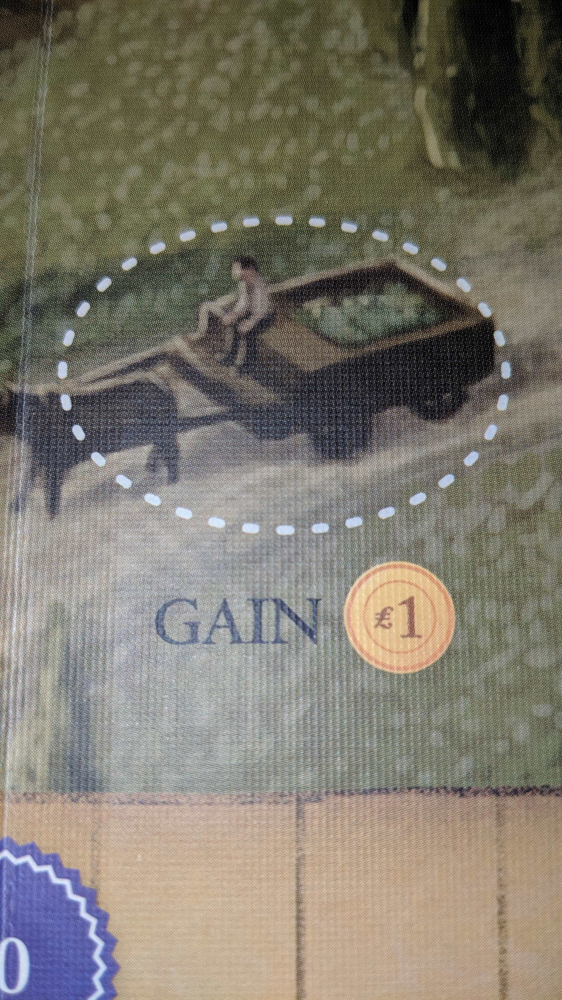
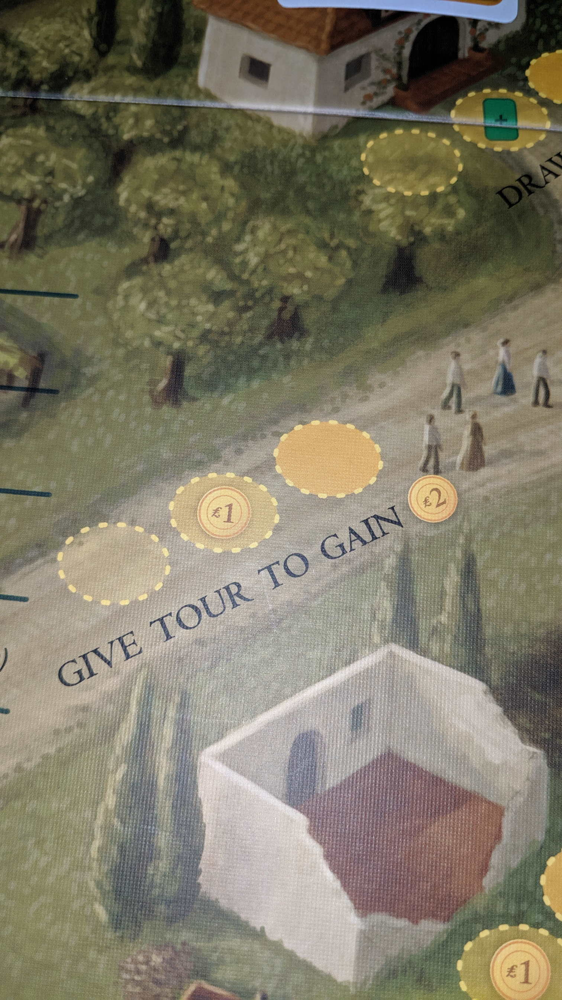
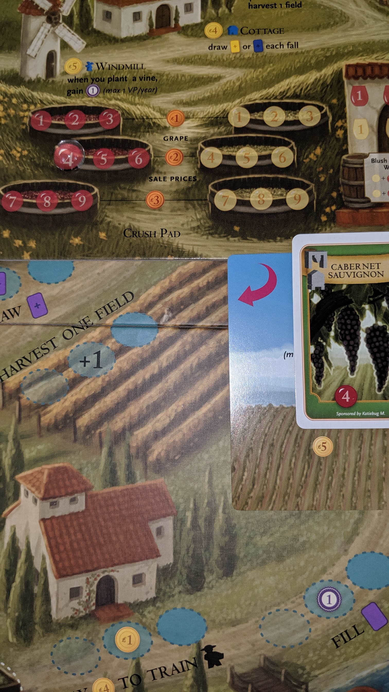

---?image=images/0.jpg&size=85% 85%&color=black

---

@snap[north-west span-50]
@color[red](Version) 
@color[blue](0.08)
@ol[list-bullets-black](false)
@olend

@snapend

@snap[north-east span-50]

@snapend

---

@snap[north-west span-50]
@color[red](RootTitle) 
@color[blue](Header)
@ol[list-bullets-black](false)
- List item
@olend

@snapend

@snap[north-east span-50]

@snapend

---

@snap[north-west span-50]
@color[red](RootTitle: SubTitle) 
@color[blue](header)
@ol[list-bullets-black](false)
- List item
@olend

@snapend

@snap[north-east span-50]

@snapend

---

@snap[north-west span-50]
@color[red](RootTitle: SubTitle: SubSubTitle) 
@color[blue](header)
@ol[list-bullets-black](false)
- list item
@olend

@snapend

@snap[north-east span-50]

@snapend

---

@snap[north-west span-50]
@color[red](How to Play) 
@color[blue](Tableu Builder.)
@ol[list-bullets-black](false)
- Roll dice to strengthen and expand your empire.
@olend

@snapend

@snap[north-east span-50]

@snapend

---

@snap[north-west span-50]
@color[red](Quick Terms: Workers) 
@color[blue](Dice.)
@ol[list-bullets-black](false)
@olend

@snapend

@snap[north-east span-50]

@snapend

---

@snap[north-west span-50]
@color[red](Quick Terms: Phase Strip) 
@color[blue](Manages Workers per Phase)
@ol[list-bullets-black](false)
@olend

@snapend

@snap[north-east span-50]

@snapend

---

@snap[north-west span-50]
@color[red](Quick Terms) 
@color[blue](Phases)
@ol[list-bullets-black](false)
- Explore
- Develop
- Settle
- Produce
- Shipping
@olend

@snapend

@snap[north-east span-50]

@snapend

---

@snap[north-west span-50]
@color[red](Quick Terms: Citizenry) 
@color[blue](Used Workers.)
@ol[list-bullets-black](false)
@olend

@snapend

@snap[north-east span-50]

@snapend

---

@snap[north-west span-50]
@color[red](Quick Terms: Cup) 
@color[blue](Pending Workers.)
@ol[list-bullets-black](false)
@olend

@snapend

@snap[north-east span-50]

@snapend

---

@snap[north-west span-50]
@color[red](Quick Terms: Construction Zone) 
@color[blue](Queue of Developments or Worlds.)
@ol[list-bullets-black](false)
@olend

@snapend

@snap[north-east span-50]

@snapend

---

@snap[north-west span-50]
@color[red](Quick Terms: Credits) 
@color[blue](Money.)
@ol[list-bullets-black](false)
@olend

@snapend

@snap[north-east span-50]

@snapend

---

@snap[north-west span-50]
@color[red](Quick Terms: Faction Tiles) 
@color[blue](Starting World/Developments)
@ol[list-bullets-black](false)
@olend

@snapend

@snap[north-east span-50]

@snapend

---

@snap[north-west span-50]
@color[red](Quick Terms: Development) 
@color[blue](Bonuses per round.)
@ol[list-bullets-black](false)
@olend

@snapend

@snap[north-east span-50]

@snapend

---

@snap[north-west span-50]
@color[red](Quick Terms: World) 
@color[blue](One time bonuses.)
@ol[list-bullets-black](false)
@olend

@snapend

@snap[north-east span-50]

@snapend

---

@snap[north-west span-50]
@color[red](Quick Terms: Consume) 
@color[blue](Goods turn into VP.)
@ol[list-bullets-black](false)
@olend

@snapend

@snap[north-east span-50]

@snapend

---

@snap[north-west span-50]
@color[red](Quick Terms: Trade) 
@color[blue](Goods turn into $)
@ol[list-bullets-black](false)
@olend

@snapend

@snap[north-east span-50]

@snapend

---

@snap[north-west span-50]
@color[red]() 
@color[blue](Round)
@ol[list-bullets-black](false)
- Roll
- Assign
- Reveal
- Phases
- Manage Empire
@olend

@snapend

@snap[north-east span-50]

@snapend

---

@snap[north-west span-50]
@color[red](Round) 
@color[blue](1. Roll)
@ol[list-bullets-black](false)
- Simultaneously
- Behind Screen
- Roll all Workers from cup
@olend

@snapend

@snap[north-east span-50]

@snapend

---

@snap[north-west span-50]
@color[red](Round) 
@color[blue](2. Assign)
@ol[list-bullets-black](false)
- Assign Worker under phase strip.
@olend

@snapend

@snap[north-east span-50]

@snapend

---

@snap[north-west span-50]
@color[red](Round: 2. Assign) 
@color[blue](Phase Selection)
@ol[list-bullets-black](false)
- Select a Phase.
- Only players selected phases will happen.
- Move any one worker to any Phase on strip.
@olend

@snapend

@snap[north-east span-50]

@snapend

---

@snap[north-west span-50]
@color[red](Round: 2. Assign) 
@color[blue](Reassign)
@ol[list-bullets-black](false)
- Reassign power works once per round.
- All players may Reassign to Dictate.
- Some developments allow special reassigns.
@olend

@snapend

@snap[north-east span-50]

@snapend

---

@snap[north-west span-50]
@color[red](Round: 2. Assign) 
@color[blue](Dicate)
@ol[list-bullets-black](false)
- Dictate "is" beside phase strip
- Reassign a different worker to a different phase.
- Dictated worker will end up in the cup.
@olend

@snapend

@snap[north-east span-50]

@snapend

---

@snap[north-west span-50]
@color[red](Round) 
@color[blue](3. Reveal)
@ol[list-bullets-black](false)
- Lift Screen
- Flip chosen Phase tiles from 'X'.
@olend

@snapend

@snap[north-east span-50]

@snapend

---

@snap[north-west span-50]
@color[red](Round: 3. Reveal) 
@color[blue](Return)
@ol[list-bullets-black](false)
- Retun 'X' phase workers to cup.
- Return Dictate workers to cup.
@olend

@snapend

@snap[north-east span-50]

@snapend

---

@snap[north-west span-50]
@color[red](Round: 4. Phases) 
@color[blue](In order execute each phase step.)
@ol[list-bullets-black](false)
- Use all assinged workers.
- Also use phase selection worker.
@olend

@snapend

@snap[north-east span-50]

@snapend

---

@snap[north-west span-50]
@color[red](Round: 4. Phases) 
@color[blue](List)
@ol[list-bullets-black](false)
- Explore
- Develop
- Settle
- Produce
- Shipping
@olend

@snapend

@snap[north-east span-50]

@snapend

---

@snap[north-west span-50]
@color[red](Round: 4. Phases) 
@color[blue](1. Explore)
@ol[list-bullets-black](false)
- Either Scout or Stock.
- Move to Citizenry.
@olend

@snapend

@snap[north-east span-50]

@snapend

---

@snap[north-west span-50]
@color[red](Round: 4. Phases: 1. Explore) 
@color[blue](SCOUT (or Stock))
@ol[list-bullets-black](false)
- Optionally abandon Construction Zone tiles.
- Draw 1 more tile than abandoned from the bag.
- Choose Development or World side.
- Place it in the Construction Zone.
@olend

@snapend

@snap[north-east span-50]

@snapend

---

@snap[north-west span-50]
@color[red](Round: 4. Phases: 1. Explore: SCOUT (or Stock): Abandon) 
@color[blue](Any tile from Construction Zone.)
@ol[list-bullets-black](false)
- Put abandoned tile under Explore Phase Tile.
- After Explore phase, return abandoned tiles to bag.
- Keep Developers and Settlers on stack.
- If developers complete a tile, don't complete until Develop/Settle phase.
@olend

@snapend

@snap[north-east span-50]

@snapend

---

@snap[north-west span-50]
@color[red](Round: 4. Phases: 1. Explore: SCOUT (or Stock): (Scout or) STOCK) 
@color[blue](Get $2)
@ol[list-bullets-black](false)
@olend

@snapend

@snap[north-east span-50]

@snapend

---

@snap[north-west span-50]
@color[red](Round: 4. Phases) 
@color[blue](2. Develop)
@ol[list-bullets-black](false)
- Put Worker on Development Construction Zone stack.
- Developments will have mandatory actions (unless 'May')
- Complete if Workers = Cost of top Development.
@olend

@snapend

@snap[north-east span-50]

@snapend

---

@snap[north-west span-50]
@color[red](Round: 4. Phases: 2. Develop) 
@color[blue](Complete)
@ol[list-bullets-black](false)
- Move tile to tableu.
- Move Workers to Citizenry.
- Continue with Develop Workers
- May complete another tile.
- If construction zone is empty, return Worker to cup.
@olend

@snapend

@snap[north-east span-50]

@snapend

---

@snap[north-west span-50]
@color[red](Round: 4. Phases) 
@color[blue](3. Settle)
@ol[list-bullets-black](false)
- Put worker on World Construction Zone stack.
- Worlds will have immediate effect.
- If effect removes dice, select from any location.
- Complete if Workers = Cost of World.
@olend

@snapend

@snap[north-east span-50]

@snapend

---

@snap[north-west span-50]
@color[red](Round: 4. Phases: 3. Settle: Complete) 
@color[blue](Move tile to tablue.)
@ol[list-bullets-black](false)
- Move Workers to Citizenry.
- Continue with Settle Workers.
@olend

@snapend

@snap[north-east span-50]

@snapend

---

@snap[north-west span-50]
@color[red](Round: 4. Phases: 4. Produce) 
@color[blue](Each Worker becomes 1 good on non-gray World.)
@ol[list-bullets-black](false)
- Good will be Traded or Consumed.
- Any color worker becomes a good.
- Matching World color only applies when Consumed, not Traded.
- World may hold 1 Good.
- Unusable Workers return to Cup.
@olend

@snapend

@snap[north-east span-50]

@snapend

---

@snap[north-west span-50]
@color[red](Round: 4. Phases: 5. Shipping) 
@color[blue](Each Worker Trades or Consumes a Good.)
@ol[list-bullets-black](false)
- Move to Citizenry both Shipping and Goods Worker.
- Purple dice is wild.
@olend

@snapend

@snap[north-east span-50]

@snapend

---

@snap[north-west span-50]
@color[red](Round: 4. Phases: 5. Shipping: Trade) 
@color[blue](Earn $ per Good.)
@ol[list-bullets-black](false)
- Income based on World color.
@olend

@snapend

@snap[north-east span-50]

@snapend

---

@snap[north-west span-50]
@color[red](Round: 4. Phases: 5. Shipping: Consume) 
@color[blue](Earn VP.)
@ol[list-bullets-black](false)
- 1VP for Good.
- +1VP for matching Good color.
- +1VP for Shipper matching World color.
@olend

@snapend

@snap[north-east span-50]

@snapend

---

@snap[north-west span-50]
@color[red](Round: 4. Phases: 5. Shipping: Consume:  Trigger EOG) 
@color[blue](If there aren't enough VP tokens, use the set aside 10VP. Trigger EOG.)
@ol[list-bullets-black](false)
@olend

@snapend

@snap[north-east span-50]

@snapend

---

@snap[north-west span-50]
@color[red](Round: 4. Phases: 6. Manage Empire) 
@color[blue](End of Round)
@ol[list-bullets-black](false)
- Recruiting
- Recall
- Reset
- Check OEG
@olend

@snapend

@snap[north-east span-50]

@snapend

---

@snap[north-west span-50]
@color[red](Round: 4. Phases: 6. Manage Empire) 
@color[blue](1. Recruit)
@ol[list-bullets-black](false)
- Recruit Workers from Citizenry per $
- After recruit if broke then +$1
@olend

@snapend

@snap[north-east span-50]

@snapend

---

@snap[north-west span-50]
@color[red](Round: 4. Phases: 6. Manage Empire) 
@color[blue](2. Recall)
@ol[list-bullets-black](false)
- Freely return any construction zone Worker to cup.
@olend

@snapend

@snap[north-east span-50]

@snapend

---

@snap[north-west span-50]
@color[red](Round: 4. Phases: 6. Manage Empire) 
@color[blue](3. Reset)
@ol[list-bullets-black](false)
- Flip Phase used Phase tiles back to 'X'.
@olend

@snapend

@snap[north-east span-50]

@snapend

---

@snap[north-west span-50]
@color[red](Round: 4. Phases: 6. Manage Empire: 4. Check EOG) 
@color[blue](A. VP pool was exhausetd)
@ol[list-bullets-black](false)
- B. Player has 12 tiles in tableu.
@olend

@snapend

@snap[north-east span-50]

@snapend

---

@snap[north-west span-50]
@color[red](Round: 5. Winner: Most VP) 
@color[blue](VP Tokens)
@ol[list-bullets-black](false)
- VP per completed developments and worlds.
- VP from 6-Cost developments rewards (rounding up).
@olend

@snapend

@snap[north-east span-50]

@snapend

---

@snap[north-west span-50]
@color[red](Round: 5. Winner: Ties) 
@color[blue](Most dice in cup + Money)
@ol[list-bullets-black](false)
@olend

@snapend

@snap[north-east span-50]

@snapend

