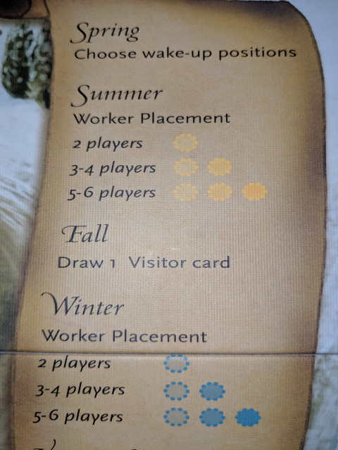

---?image=images/1.jpg&size=85% 85%&color=black

---

@snap[north-west span-50]
@color[red](Roll Dice, Collect Goods/Foods) 
@color[blue](Roll one die per city.)
@ol[list-bullets-black](false)
- You start with three.
- Keep dice with skulls.
- Keep or reroll any other dice 2X.
@olend

@snapend

@snap[north-east span-50]

@snapend

---

@snap[north-west span-50]
@color[red](Collect Goods) 
@color[blue](Starting from the bottom row shift one to the right.)
@ol[list-bullets-black](false)
- More Goods, then go up a row and shift one to the right.
- Until youre out of goods.
- If the row was full you don't collect it but it still counts.
@olend

@snapend

@snap[north-east span-50]

@snapend

---

@snap[north-west span-50]
@color[red](Collect Food) 
@color[blue](Advanced food peg one position for each food symbol on the dice.)
@ol[list-bullets-black](false)
- Don't collect food if row was full.
@olend

@snapend

@snap[north-east span-50]

@snapend

---

@snap[north-west span-50]
@color[red](Feed Cities and Resolve Disasters: Feed Cities) 
@color[blue](Each city requires one food.)
@ol[list-bullets-black](false)
- Subtract one food from pegboard.
- Any unfed city suffers Famine.
@olend

@snapend

@snap[north-east span-50]

@snapend

---

@snap[north-west span-50]
@color[red](Feed Cities and Resolve Disasters: Trackin lost points) 
@color[blue](Check Disasters Box for each point lost.)
@ol[list-bullets-black](false)
- These will be subtracted from your score EOG.
- Resolved disasters from table 2.
@olend

@snapend

@snap[north-east span-50]

@snapend

---

@snap[north-west span-50]
@color[red](Build Cities/Monuments) 
@color[blue](For each worker on dice.)
@ol[list-bullets-black](false)
- Check off a box in the City or Monument.
- Once it's all checked it's built.
- Incomplete monuments are worth nothing.
@olend

@snapend

@snap[north-east span-50]

@snapend

---

@snap[north-west span-50]
@color[red](Build Cities/Monuments: If you're the first specific monument builder) 
@color[blue](Circle the larger number of points.)
@ol[list-bullets-black](false)
- Everybody else will get smaller.
@olend

@snapend

@snap[north-east span-50]

@snapend

---

@snap[north-west span-50]
@color[red](buy a development) 
@color[blue](You may buy one development per turn.)
@ol[list-bullets-black](false)
- Circled the endgame points.
- Buy **** and goods equal to the cost.
- If you spend goods you must spend all goods of that type.
- No change back.
@olend

@snapend

@snap[north-east span-50]

@snapend

---

@snap[north-west span-50]
@color[red](buy a development: (cont.)) 
@color[blue](Each development maybe bought once.)
@ol[list-bullets-black](false)
- table 3?
@olend

@snapend

@snap[north-east span-50]

@snapend

---

@snap[north-west span-50]
@color[red](Discard Goods) 
@color[blue](You may only keep 6 goods total.)
@ol[list-bullets-black](false)
- Move pegs left until you have 6 goods.
- Pass the dice to the next player.
@olend

@snapend

@snap[north-east span-50]

@snapend

---

@snap[north-west span-50]
@color[red](Game End) 
@color[blue](One player buys 5th development.)
@ol[list-bullets-black](false)
- Each monument has been built once.
- Play until the end of round.
@olend

@snapend

@snap[north-east span-50]

@snapend

---

@snap[north-west span-50]
@color[red](Scoring) 
@color[blue](Tally scores for:)
@ol[list-bullets-black](false)
- Development.
- Monument.
- Give or take Architecture.
- Give or take Empire.
- Subtract one point for every disaster.
@olend

@snapend

@snap[north-east span-50]

@snapend

---

@snap[north-west span-50]
@color[red](Winning the Game) 
@color[blue](Highest score wins.)
@ol[list-bullets-black](false)
- Ties broken by remaining goods.
- Or were the most ****.
- Thank you.
