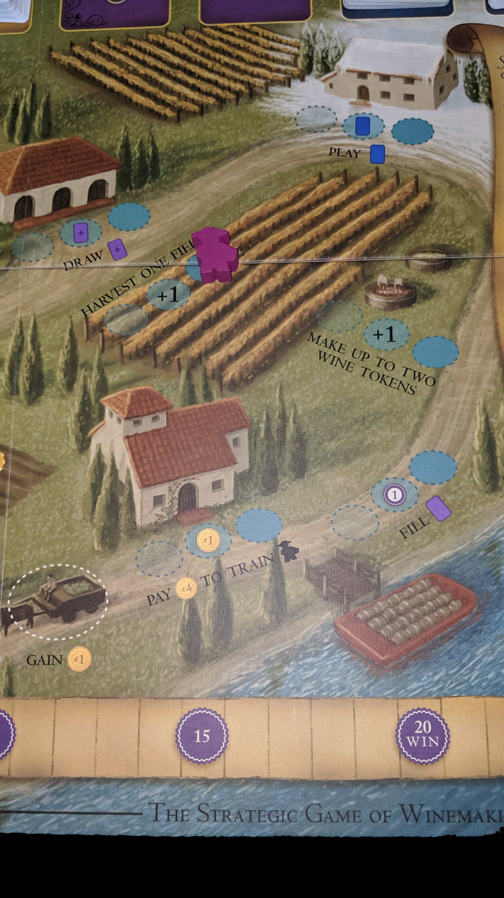
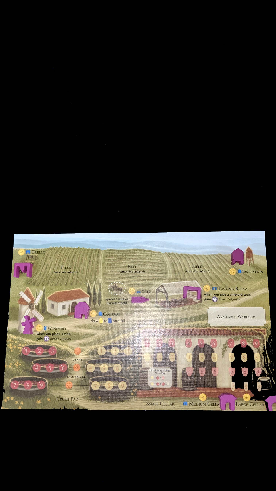

---?image=images/0.jpg&size=85% 85%&color=black

---

@snap[north-west span-50]
@color[red](Version) 
@color[blue](0.0.1)
@ol[list-bullets-black](false)
@olend

@snapend

@snap[north-east span-50]

@snapend

---

@snap[north-west span-50]
@color[red](How to Play) 
@color[blue](Grow and sell wine to earn the most reputation (20VP).)
@ol[list-bullets-black](false)
@olend

@snapend

@snap[north-east span-50]

@snapend

---

@snap[north-west span-50]
@color[red](Quick Terms: Fields) 
@color[blue](Holds Vines.)
@ol[list-bullets-black](false)
@olend

@snapend

@snap[north-east span-50]

@snapend

---

@snap[north-west span-50]
@color[red](Quick Terms: Vines) 
@color[blue](Produces grapes.)
@ol[list-bullets-black](false)
@olend

@snapend

@snap[north-east span-50]

@snapend

---

@snap[north-west span-50]
@color[red](Quick Terms: Crush Pad) 
@color[blue](Holds Grapes.)
@ol[list-bullets-black](false)
@olend

@snapend

@snap[north-east span-50]

@snapend

---

@snap[north-west span-50]
@color[red](Quick Terms: Cellar) 
@color[blue](Holds wine.)
@ol[list-bullets-black](false)
@olend

@snapend

@snap[north-east span-50]

@snapend

---

@snap[north-west span-50]
@color[red](Quick Terms: Orders) 
@color[blue](Sell wine.)
@ol[list-bullets-black](false)
@olend

@snapend

@snap[north-east span-50]

@snapend

---

@snap[north-west span-50]
@color[red](Quick Terms: Visitors) 
@color[blue](Provides actions or rewards.)
@ol[list-bullets-black](false)
@olend

@snapend

@snap[north-east span-50]

@snapend

---

@snap[north-west span-50]
@color[red](Quick Terms: Workers) 
@color[blue](Used to claim available actions.)
@ol[list-bullets-black](false)
@olend

@snapend

@snap[north-east span-50]

@snapend

---

@snap[north-west span-50]
@color[red](Quick Terms: El Grande) 
@color[blue](Same as Worker, also can be placed on a filled action space (no bonuses gained).)
@ol[list-bullets-black](false)
@olend

@snapend

@snap[north-east span-50]

@snapend

---

@snap[north-west span-50]
@color[red](Quick Terms: Residual Payments) 
@color[blue](Earned when filling orders.)
@ol[list-bullets-black](false)
- Collected at EOY.
- Max 5.
@olend

@snapend

@snap[north-east span-50]

@snapend

---

@snap[north-west span-50]
@color[red](Phases: Spring: Wake Up.) 
@color[blue](Place Rooster on the Wake Up chart.)
@ol[list-bullets-black](false)
- Dictates turn order and benefits received.
@olend

@snapend

@snap[north-east span-50]

@snapend

---

@snap[north-west span-50]
@color[red](Phases: Summer) 
@color[blue](In Wake Up order.)
@ol[list-bullets-black](false)
- Place 1 worker on an available Summer action space (yellow)
- Each action space has 1 bonus slot
- Pass and save remaining workers for Winter.
@olend

@snapend

@snap[north-east span-50]

@snapend

---

@snap[north-west span-50]
@color[red](Phases: Fall) 
@color[blue](In Wake Up order.)
@ol[list-bullets-black](false)
- Draw one Visitor card.
- Summer - Yellow
- Winter - Blue
@olend

@snapend

@snap[north-east span-50]

@snapend

---

@snap[north-west span-50]
@color[red](Phases: Winter) 
@color[blue](In Wake Up order.)
@ol[list-bullets-black](false)
- Place 1 worker on an available Winter action space (blue).
- Each action space has 1 bonus slot
- Gain $1 always available
@olend

@snapend

@snap[north-east span-50]

@snapend

---

@snap[north-west span-50]
@color[red](Phases: EOR) 
@color[blue](Age Grapes and Wines.)
@ol[list-bullets-black](false)
- Return Workers and Rooster.
- Collect Residuals.
- Rotate Starting Player counter clockwise.
- Check EOG.
@olend

@snapend

@snap[north-east span-50]

@snapend

---

@snap[north-west span-50]
@color[red](Phases: EOG) 
@color[blue](Once a player has reached 20+VP.)
@ol[list-bullets-black](false)
@olend

@snapend

@snap[north-east span-50]

@snapend

---

@snap[north-west span-50]
@color[red](Vines) 
@color[blue](Color)
@ol[list-bullets-black](false)
- Value(s): where it starts on Crush Pad
- Multiple Vine Cards add to red or white total
- PreRequisite: None, Trellis and/or Irrigation
- May be harvested once a year
@olend

@snapend

@snap[north-east span-50]

@snapend

---

@snap[north-west span-50]
@color[red](Wine Order Card) 
@color[blue](Required Wine(s) value.)
@ol[list-bullets-black](false)
- VP Earned.
- Increase Residual Payment icon.
@olend

@snapend

@snap[north-east span-50]

@snapend

---

@snap[north-west span-50]
@color[red](Devalue / Overvalue: Grape/Wine(s)) 
@color[blue](If you earn a level 4 grape/wine)
@ol[list-bullets-black](false)
- And you already have a level 4 grape/wine
- You may add it as the next available lower value
@olend

@snapend

@snap[north-east span-50]

@snapend

---

@snap[north-west span-50]
@color[red](Devalue / Overvalue: Cellar limit) 
@color[blue](If you earn a level 5 grape/wine)
@ol[list-bullets-black](false)
- But don't have the corresponding cellar
- You may add it as the next available lower value
@olend

@snapend

@snap[north-east span-50]

@snapend

---

@snap[north-west span-50]
@color[red](Devalue / Overvalue: Overvalued Wine(s)) 
@color[blue](If you need to fill an order with a level 4 wine)
@ol[list-bullets-black](false)
- And you don't have a level 4 wine
- You may fill the order with the next available higher value wine
@olend

@snapend

@snap[north-east span-50]

@snapend

---

@snap[north-west span-50]
@color[red](Structures: $2 Trellis) 
@color[blue](Requirement for certain vines.)
@ol[list-bullets-black](false)
@olend

@snapend

@snap[north-east span-50]

@snapend

---

@snap[north-west span-50]
@color[red](Structures: $5 Windmill) 
@color[blue](Collect 1VP per future planted vines.)
@ol[list-bullets-black](false)
@olend

@snapend

@snap[north-east span-50]

@snapend

---

@snap[north-west span-50]
@color[red](Structures: $3 Irrigation) 
@color[blue](Requirement for certain vines.)
@ol[list-bullets-black](false)
@olend

@snapend

@snap[north-east span-50]

@snapend

---

@snap[north-west span-50]
@color[red](Structures: $2 Yoke) 
@color[blue](Action space for Summer or Winter.)
@ol[list-bullets-black](false)
- Uproot or Harvest
@olend

@snapend

@snap[north-east span-50]

@snapend

---

@snap[north-west span-50]
@color[red](Structures: $6 Tasting Room) 
@color[blue](Collect 1VP per future Wine tour if you have at least 1 wine.)
@ol[list-bullets-black](false)
@olend

@snapend

@snap[north-east span-50]

@snapend

---

@snap[north-west span-50]
@color[red](Structures: $4/$6 Cellars) 
@color[blue](Medium, Large.)
@ol[list-bullets-black](false)
- Stores more/higher valued wine.
@olend

@snapend

@snap[north-east span-50]

@snapend

---

@snap[north-west span-50]
@color[red](Structures: $4 Cottage) 
@color[blue](Draw 1 extra Fall Visitor card.)
@ol[list-bullets-black](false)
@olend

@snapend

@snap[north-east span-50]

@snapend

---

@snap[north-west span-50]
@color[red](Worker Placement) 
@color[blue](Summer Worker Placement)
@ol[list-bullets-black](false)
- Winter Worker Placement
- Must be able to resolve action to take it.
- Bonuses are optional.
@olend

@snapend

@snap[north-east span-50]

@snapend

---

@snap[north-west span-50]
@color[red](Summer Worker Placement: Gain $1) 
@color[blue](Available in Summer or Winter.)
@ol[list-bullets-black](false)
- No worker limit.
@olend

@snapend

@snap[north-east span-50]

@snapend

---

@snap[north-west span-50]
@color[red](Summer Worker Placement: Uproot) 
@color[blue](Action from visitor cards or yoke.)
@ol[list-bullets-black](false)
- Take one planted field back into your hand.
@olend

@snapend

@snap[north-east span-50]

@snapend

---

@snap[north-west span-50]
@color[red](Summer Worker Placement: Summer Visitor (yellow)) 
@color[blue](Must be able to resolve visitor card.)
@ol[list-bullets-black](false)
- BONUS: resolve second Summer Visitor card.
@olend

@snapend

@snap[north-east span-50]

@snapend

---

@snap[north-west span-50]
@color[red](Summer Worker Placement: Draw Vine Card) 
@color[blue](BONUS: draw second vine card.)
@ol[list-bullets-black](false)
@olend

@snapend

@snap[north-east span-50]

@snapend

---

@snap[north-west span-50]
@color[red](Summer Worker Placement: Plant Vine Card) 
@color[blue](Play on empty field.)
@ol[list-bullets-black](false)
- Or where it won't exceed the field limit.
- Offset card to keep all grape values visible.
- You will produce 1 red and or 1 white from totals.
- BONUS: plant second vine card.
@olend

@snapend

@snap[north-east span-50]

@snapend

---

@snap[north-west span-50]
@color[red](Summer Worker Placement: $2 Vineyard Tour) 
@color[blue](BONUS: gain $1.)
@ol[list-bullets-black](false)
@olend

@snapend

@snap[north-east span-50]

@snapend

---

@snap[north-west span-50]
@color[red](Summer Worker Placement: Build Structure) 
@color[blue](BONUS: gain $1.)
@ol[list-bullets-black](false)
@olend

@snapend

@snap[north-east span-50]

@snapend

---

@snap[north-west span-50]
@color[red](Summer Worker Placement: Sell >= 1 Grape OR Buy/Sell 1 Field) 
@color[blue](Sell any grape from Crush Pad for it's row's value.)
@ol[list-bullets-black](false)
- OR sell back a field card unless it has vines.
- BONUS: gain 1VP.
@olend

@snapend

@snap[north-east span-50]

@snapend

---

@snap[north-west span-50]
@color[red](Winter Worker Placement: Draw 1 Wine Order Card (purple)) 
@color[blue](BONUS: Draw an additional Wine Order Card.)
@ol[list-bullets-black](false)
@olend

@snapend

@snap[north-east span-50]

@snapend

---

@snap[north-west span-50]
@color[red](Winter Worker Placement: Harvest 1 field) 
@color[blue](Choose 1 field to add grape tokens based on yield values.)
@ol[list-bullets-black](false)
- Vine Cards stay on field.
- BONUS: Harvest an additional field.
@olend

@snapend

@snap[north-east span-50]

@snapend

---

@snap[north-west span-50]
@color[red](Winter Worker Placement: Gain $1) 
@color[blue](Available in Summer or Winter.)
@ol[list-bullets-black](false)
- No worker limit.
@olend

@snapend

@snap[north-east span-50]

@snapend

---

@snap[north-west span-50]
@color[red](Winter Worker Placement: Pay $4 to train 1 worker) 
@color[blue](Place new worker on this space.)
@ol[list-bullets-black](false)
- Will be picked up at EOY.
- BONUS: Gain $1.
@olend

@snapend

@snap[north-east span-50]

@snapend

---

@snap[north-west span-50]
@color[red](Winter Worker Placement: Play 1 Winter Visitor Card (blue)) 
@color[blue](Must be able to resolve visitor card.)
@ol[list-bullets-black](false)
- BONUS: resolve second Winter Visitor card.
@olend

@snapend

@snap[north-east span-50]

@snapend

---

@snap[north-west span-50]
@color[red](Winter Worker Placement: Make up to 2 Wine Tokens) 
@color[blue](Convert Crush Pad Grapes to Wine(s).)
@ol[list-bullets-black](false)
- Level 4 Grape converts to level 4 Wine.
- Wines that require two or three grapes equal sum of two grapes.
- BONUS: Make 1 extra Wine Token
@olend

@snapend

@snap[north-east span-50]

@snapend

---

@snap[north-west span-50]
@color[red](Winter Worker Placement: Fill 1 Wine Order) 
@color[blue](Some Visitor cards allow this action.)
@ol[list-bullets-black](false)
- Must be able to resolve order card.
- Discard used Wine token.
- BONUS: Gain $1
@olend

@snapend

@snap[north-east span-50]

@snapend

---

@snap[north-west span-50]
@color[red](EOY) 
@color[blue](If room, increase all Wines and Grapes by 1.)
@ol[list-bullets-black](false)
- Collect Workers.
- Collect Residual Payments.
- Discard down to 7 cards.
- Rotate first player counter-clockwise.
@olend

@snapend

@snap[north-east span-50]

@snapend

---

@snap[north-west span-50]
@color[red](Winning) 
@color[blue](Highest VP.)
@ol[list-bullets-black](false)
- Tiebreakers...
- Most money.
- Highest value of wine in Cellar.
- Highest value of grapes in Crush Pad.
