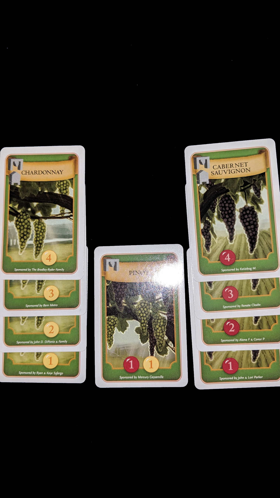

---?image=images/0.jpg&size=85% 85%&color=black

---

@snap[north-west span-50]
@color[red](How to Play) 
@color[blue](Tableau Builder.)
@ol[list-bullets-black](false)
- Roll Dice for resources
- Upgrade Nation to earn VP.
@olend

@snapend

@snap[north-east span-50]

@snapend

---

@snap[north-west span-50]
@color[red](Quick Terms: Age) 
@color[blue](1-4 rounds.)
@ol[list-bullets-black](false)
- Upgrades increase per round.
@olend

@snapend

@snap[north-east span-50]

@snapend

---

@snap[north-west span-50]
@color[red](Quick Terms: Dice) 
@color[blue](Colored by Resource Distribution.)
@ol[list-bullets-black](false)
@olend

@snapend

@snap[north-east span-50]

@snapend

---

@snap[north-west span-50]
@color[red](Quick Terms: Tokens) 
@color[blue](Guaranteed Dice Side.)
@ol[list-bullets-black](false)
@olend

@snapend

@snap[north-east span-50]

@snapend

---

@snap[north-west span-50]
@color[red](Quick Terms: Events) 
@color[blue](EOR Goals)
@ol[list-bullets-black](false)
- How many food or swords to score VP.
@olend

@snapend

@snap[north-east span-50]

@snapend

---

@snap[north-west span-50]
@color[red](Quick Terms: Player Order Card) 
@color[blue](Order number)
@ol[list-bullets-black](false)
- Marks has passed for round.
@olend

@snapend

@snap[north-east span-50]

@snapend

---

@snap[north-west span-50]
@color[red](Quick Terms: Tiles) 
@color[blue](Available Upgrades; Buildings, Advisors, Colonies, Wonders.)
@ol[list-bullets-black](false)
@olend

@snapend

@snap[north-east span-50]

@snapend

---

@snap[north-west span-50]
@color[red](Quick Terms: Buildings) 
@color[blue](Provides Dice.)
@ol[list-bullets-black](false)
@olend

@snapend

@snap[north-east span-50]

@snapend

---

@snap[north-west span-50]
@color[red](Quick Terms: Advisors) 
@color[blue](Provides Rerolls)
@ol[list-bullets-black](false)
@olend

@snapend

@snap[north-east span-50]

@snapend

---

@snap[north-west span-50]
@color[red](Quick Terms: Colonies) 
@color[blue](Provides Tokens.)
@ol[list-bullets-black](false)
@olend

@snapend

@snap[north-east span-50]

@snapend

---

@snap[north-west span-50]
@color[red](Quick Terms: Books) 
@color[blue](EOR VP)
@ol[list-bullets-black](false)
@olend

@snapend

@snap[north-east span-50]

@snapend

---

@snap[north-west span-50]
@color[red](Quick Terms: Famine) 
@color[blue](EOR VP)
@ol[list-bullets-black](false)
@olend

@snapend

@snap[north-east span-50]

@snapend

---

@snap[north-west span-50]
@color[red](Quick Terms: War) 
@color[blue](EOR VP)
@ol[list-bullets-black](false)
@olend

@snapend

@snap[north-east span-50]

@snapend

---

@snap[north-west span-50]
@color[red](New Age) 
@color[blue](Remove old Age Tiles.)
@ol[list-bullets-black](false)
- Place new Age Tiles.
- Move used Tokens and Dice to unused area.
- Reset player order card.
- Roll Dice.
@olend

@snapend

@snap[north-east span-50]

@snapend

---

@snap[north-west span-50]
@color[red](Trading Dice) 
@color[blue](At anytime; 2 dice = 1 gold, food, stone.)
@ol[list-bullets-black](false)
@olend

@snapend

@snap[north-east span-50]

@snapend

---

@snap[north-west span-50]
@color[red](Actions) 
@color[blue](One action per turn.)
@ol[list-bullets-black](false)
- Repeat until all players pass.
@olend

@snapend

@snap[north-east span-50]

@snapend

---

@snap[north-west span-50]
@color[red](Actions: Actions) 
@color[blue](Reroll)
@ol[list-bullets-black](false)
- Buy Tile
- Build Wonder
- Pass
@olend

@snapend

@snap[north-east span-50]

@snapend

---

@snap[north-west span-50]
@color[red](Actions: Reroll) 
@color[blue](Move reroll Token to used area.)
@ol[list-bullets-black](false)
- Reroll 1+ unused dice.
@olend

@snapend

@snap[north-east span-50]

@snapend

---

@snap[north-west span-50]
@color[red](Actions: Buy Tile) 
@color[blue](Use Gold or Sword)
@ol[list-bullets-black](false)
- No change.
@olend

@snapend

@snap[north-east span-50]

@snapend

---

@snap[north-west span-50]
@color[red](Actions: Buy Tile: Buildings) 
@color[blue](Buildings replace buildings.)
@ol[list-bullets-black](false)
- Return replaced buildings used/unused dice.
- Roll new building's dice to unused area.
@olend

@snapend

@snap[north-east span-50]

@snapend

---

@snap[north-west span-50]
@color[red](Actions: Buy Tile: Advisors) 
@color[blue](Advisors replace/add Advisors)
@ol[list-bullets-black](false)
@olend

@snapend

@snap[north-east span-50]

@snapend

---

@snap[north-west span-50]
@color[red](Actions: Buy Tile: Colonies) 
@color[blue](Colonies add on.)
@ol[list-bullets-black](false)
@olend

@snapend

@snap[north-east span-50]

@snapend

---

@snap[north-west span-50]
@color[red](Actions: Buy Tile: Wonders) 
@color[blue](Wonders replace/add to Wonder build zone.)
@ol[list-bullets-black](false)
- Buiilt Wonders add on.
@olend

@snapend

@snap[north-east span-50]

@snapend

---

@snap[north-west span-50]
@color[red](Actions: Build Wonder) 
@color[blue](Use stone to build.)
@ol[list-bullets-black](false)
- Add token/dice from Wonder
- Leave VP for EOG
@olend

@snapend

@snap[north-east span-50]

@snapend

---

@snap[north-west span-50]
@color[red](Actions: Passing) 
@color[blue](Tap player order card.)
@ol[list-bullets-black](false)
@olend

@snapend

@snap[north-east span-50]

@snapend

---

@snap[north-west span-50]
@color[red](EOR: Books) 
@color[blue](In reverse order.)
@ol[list-bullets-black](false)
- Use Books to increase counter.
- Score VP per out ranked player.
@olend

@snapend

@snap[north-east span-50]

@snapend

---

@snap[north-west span-50]
@color[red](EOR: Famine) 
@color[blue](In reverse order.)
@ol[list-bullets-black](false)
- Use food to score VP for EOR Goal
@olend

@snapend

@snap[north-east span-50]

@snapend

---

@snap[north-west span-50]
@color[red](EOR: Player Order) 
@color[blue](Highest unused swords)
@ol[list-bullets-black](false)
- Ties resolve to previous order.
- Doesn't use the swords.
@olend

@snapend

@snap[north-east span-50]

@snapend

---

@snap[north-west span-50]
@color[red](EOR: War) 
@color[blue](In reverse order.)
@ol[list-bullets-black](false)
- Use unused swords to score VP for EOR Goal
@olend

@snapend

@snap[north-east span-50]

@snapend

---

@snap[north-west span-50]
@color[red](EOR: EOR) 
@color[blue](Continue to next Age, or EOG.)
@ol[list-bullets-black](false)
@olend

@snapend

@snap[north-east span-50]

@snapend

---

@snap[north-west span-50]
@color[red](EOG) 
@color[blue](Add Tile VP.)
@ol[list-bullets-black](false)
- Highest VP Wins.
- Ties broke by player order.
