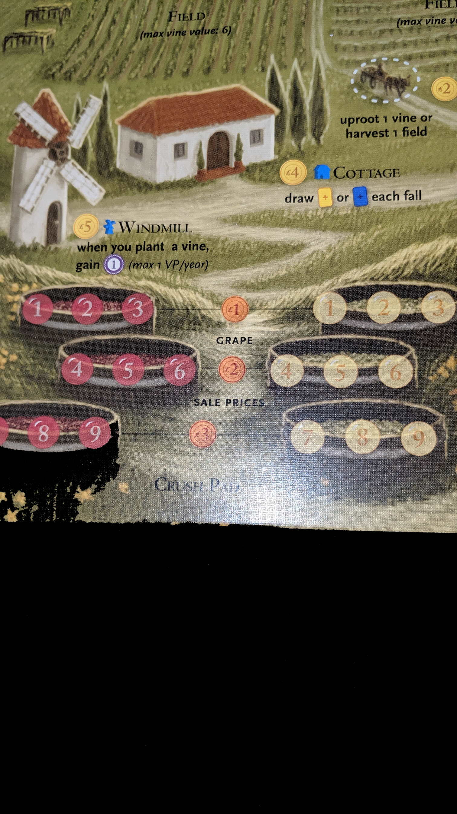
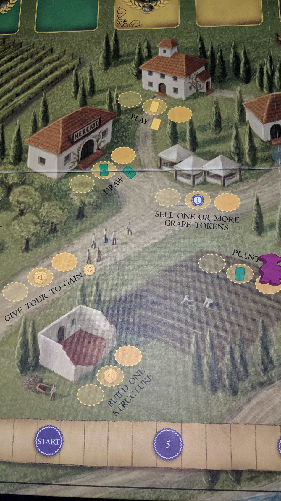

---?image=images/0.jpg&size=85% 85%&color=black

---

@snap[north-west span-50]
@color[red](Version) 
@color[blue](0.0.2)
@ol[list-bullets-black](false)
@olend

@snapend

@snap[north-east span-50]

@snapend

---

@snap[north-west span-50]
@color[red]() 
@color[blue](How to Play)
@ol[list-bullets-black](false)
- Shake down business' to earn resources.
- Use resources to complete jobs.
- Complete jobs to earn money.
- Get money from hand to suitcase.
- Earn the most money in your suitcase to win.
@olend

@snapend

@snap[north-east span-50]

@snapend

---

@snap[north-west span-50]
@color[red](Quick Terms:) 
@color[blue]()
@ol[list-bullets-black](false)
@olend

@snapend

@snap[north-east span-50]

@snapend

---

@snap[north-west span-50]
@color[red](Phases) 
@color[blue](Open New Business)
@ol[list-bullets-black](false)
- Family Business
- Turf War
- Bribery
- Tribute to the Don
@olend

@snapend

@snap[north-east span-50]

@snapend

---

@snap[north-west span-50]
@color[red](Phases) 
@color[blue](Open New Business)
@ol[list-bullets-black](false)
- Add 1 Business to city.
@olend

@snapend

@snap[north-east span-50]

@snapend

---

@snap[north-west span-50]
@color[red](Phases) 
@color[blue](Family Business)
@ol[list-bullets-black](false)
- Each Player clockwise
- 1 Action at a time
- until everybody passes.
@olend

@snapend

@snap[north-east span-50]

@snapend

---

@snap[north-west span-50]
@color[red](Phases: Family Business) 
@color[blue]()
@ol[list-bullets-black](false)
- Can't move things between Bank, Hand, or Suitcase unless provided by action.
- e.x. Can't make change.
@olend

@snapend

@snap[north-east span-50]

@snapend

---

@snap[north-west span-50]
@color[red](Phases: Family Business) 
@color[blue](Actions)
@ol[list-bullets-black](false)
- Play a Thug.
- Play a Family Member.
- Complete a Job.
- Play an Ally.
@olend

@snapend

@snap[north-east span-50]

@snapend

---

@snap[north-west span-50]
@color[red](Phases: Family Business: Actions) 
@color[blue](Play a Thug)
@ol[list-bullets-black](false)
- Place a thug in the 'front' of a business.
- Perform 'front' actions.
- If Neighboorhood is controlled by another player, they also get the actions.
@olend

@snapend

@snap[north-east span-50]

@snapend

---

@snap[north-west span-50]
@color[red](Phases: Family Business: Actions) 
@color[blue](Play a Family Member)
@ol[list-bullets-black](false)
- Play family member on neighborhood circle.
- Perform 'back' actions from every adjacent neighborhood's businesses.
@olend

@snapend

@snap[north-east span-50]

@snapend

---

@snap[north-west span-50]
@color[red](Phases: Family Business: Actions) 
@color[blue](Complete a Job)
@ol[list-bullets-black](false)
- Can complete from hand or shared job board.
- Pay goods, take job rewards.
- Put completed job in suitcase.
- Doesn't use a person, but must have somebody remaining.
@olend

@snapend

@snap[north-east span-50]

@snapend

---

@snap[north-west span-50]
@color[red](Phases: Family Business: Actions: ) 
@color[blue](Gunned Down people move to Hudson River.)
@ol[list-bullets-black](false)
@olend

@snapend

@snap[north-east span-50]

@snapend

---

@snap[north-west span-50]
@color[red](Phases: Family Business: Actions) 
@color[blue](Play an Ally)
@ol[list-bullets-black](false)
- Put faceup infront of you
- Perform actions.
@olend

@snapend

@snap[north-east span-50]

@snapend

---

@snap[north-west span-50]
@color[red](Phases: Turf War) 
@color[blue](See who controls a neighborhood.)
@ol[list-bullets-black](false)
@olend

@snapend

@snap[north-east span-50]

@snapend

---

@snap[north-west span-50]
@color[red](Phases: Turf War) 
@color[blue]()
@ol[list-bullets-black](false)
- +1 per thug/family member 'in' neighborhood.
- Family members are considered 'in' all adjacent neighborhood's.
- Neutral people count as a 'Neutral' gang.
- If somebody wins, place control marker in neighborhood.
@olend

@snapend

@snap[north-east span-50]

@snapend

---

@snap[north-west span-50]
@color[red](Phases: Turf War) 
@color[blue]()
@ol[list-bullets-black](false)
- If you already control, add one more.
- Matters for EOG VP.
- If your out of control markers, may move an existing one.
- Top most control marker indicates control of neighborhood.
@olend

@snapend

@snap[north-east span-50]

@snapend

---

@snap[north-west span-50]
@color[red](Phases) 
@color[blue](Bribery Phase)
@ol[list-bullets-black](false)
- Silently bid suitcase money for an Ally card.
- The player who bid the most gets first pick...
- Ties broken by turn order.
@olend

@snapend

@snap[north-east span-50]

@snapend

---

@snap[north-west span-50]
@color[red](Phases: Bribery Phase: ) 
@color[blue](Must bid at least $1 to get an Ally.)
@ol[list-bullets-black](false)
- Last place doesn't get an Ally, but can return money to suitcase.
- Allys will not count towards hand limit.
@olend

@snapend

@snap[north-east span-50]

@snapend

---

@snap[north-west span-50]
@color[red](Phases) 
@color[blue](Tribute to the Don)
@ol[list-bullets-black](false)
- Return all people.
- Advance Act Track.
- Replenish Jobs.
- Remove any non Bribed Allies.
- Stock Allies.
- Return to hand Ally cards.
- Discard down to hand limit.
@olend

@snapend

@snap[north-east span-50]

@snapend

---

@snap[north-west span-50]
@color[red]() 
@color[blue](EOG)
@ol[list-bullets-black](false)
- Hand limit was 2, but you may move money to your suitcase.
- Discard anything else in hand.
- From suitcase - seperate money and each job color.
@olend

@snapend

@snap[north-east span-50]

@snapend

---

@snap[north-west span-50]
@color[red](EOG) 
@color[blue](EOG Bonuses)
@ol[list-bullets-black](false)
- $5 for neighborhoods won (most control markers).
- Ties broken by highest control marker in stack.
- $5 for most completed jobs by color.
- Ties all get $5
@olend

@snapend

@snap[north-east span-50]

@snapend

---

@snap[north-west span-50]
@color[red](EOG) 
@color[blue](Winning)
@ol[list-bullets-black](false)
- Player with the most money wins.
- Ties broken by most neighborhoods won.
- 
- Good Luck
