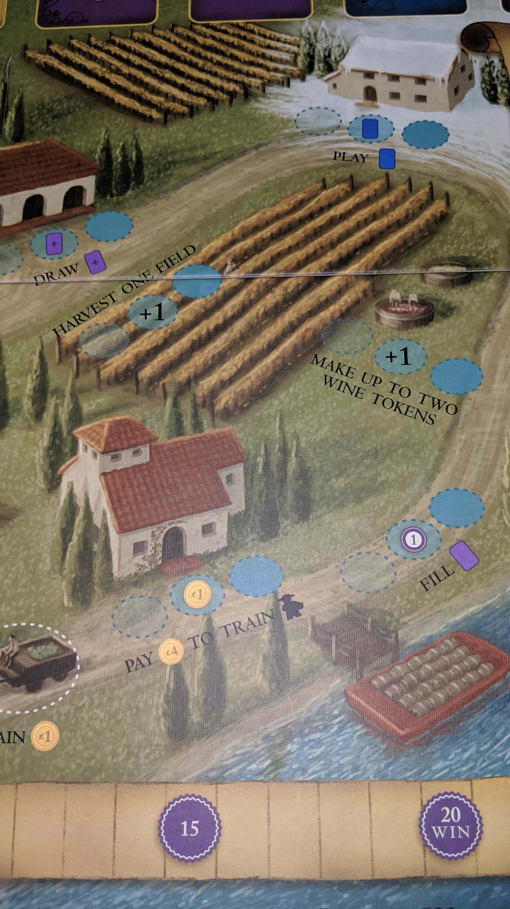
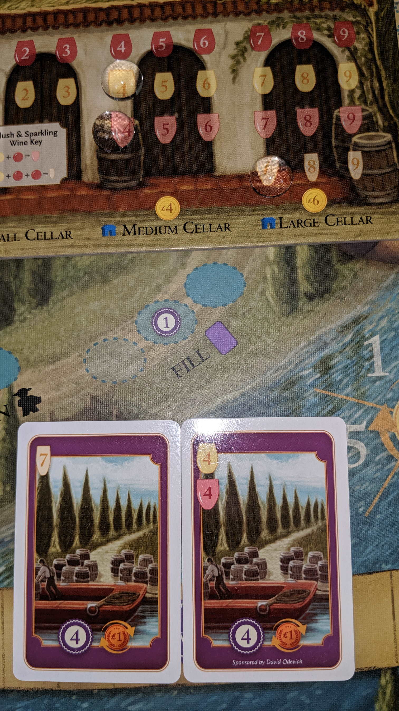

---?image=images/dinosaur_island_cover.png&size=85% 85%&color=black

---

@snap[north-west span-50]
@color[red](PRE: How to Play) 
@color[blue](Perfect DNA)
@ol[list-bullets-black](false)
- Create Dinosaurs
- Create Jurassic Park
- Hire the Personnel
- Build Attractions
- Don’t Forget Security
@olend

@snapend

@snap[north-east span-50]

@snapend

---

@snap[north-west span-50]
@color[red](PRE: Quick Terms: Dice) 
@color[blue](Resources available to scientists.)
@ol[list-bullets-black](false)
@olend

@snapend

@snap[north-east span-50]

@snapend

---

@snap[north-west span-50]
@color[red](PRE: Quick Terms: DNA) 
@color[blue](Pieces of DNA to build a Dinosaur.)
@ol[list-bullets-black](false)
@olend

@snapend

@snap[north-east span-50]

@snapend

---

@snap[north-west span-50]
@color[red](PRE: Quick Terms: Recipe) 
@color[blue](DNA Requirements of a known dinosaur.)
@ol[list-bullets-black](false)
@olend

@snapend

@snap[north-east span-50]

@snapend

---

@snap[north-west span-50]
@color[red](PRE: Quick Terms: Money) 
@color[blue](Currency.)
@ol[list-bullets-black](false)
@olend

@snapend

@snap[north-east span-50]

@snapend

---

@snap[north-west span-50]
@color[red](PRE: Quick Terms: Dinosaur) 
@color[blue](Built, then contained in Exhibits.)
@ol[list-bullets-black](false)
@olend

@snapend

@snap[north-east span-50]

@snapend

---

@snap[north-west span-50]
@color[red](PRE: Quick Terms: Lab) 
@color[blue](Your work area.)
@ol[list-bullets-black](false)
@olend

@snapend

@snap[north-east span-50]

@snapend

---

@snap[north-west span-50]
@color[red](PRE: Quick Terms: Attraction) 
@color[blue](Shops or Food Park locations.)
@ol[list-bullets-black](false)
@olend

@snapend

@snap[north-east span-50]

@snapend

---

@snap[north-west span-50]
@color[red](PRE: Quick Terms: Exhibit) 
@color[blue](Dinosaur Park locations.)
@ol[list-bullets-black](false)
@olend

@snapend

@snap[north-east span-50]

@snapend

---

@snap[north-west span-50]
@color[red](PRE: Quick Terms: Cold Storage) 
@color[blue](Cooler size you can hold DNA.)
@ol[list-bullets-black](false)
@olend

@snapend

@snap[north-east span-50]

@snapend

---

@snap[north-west span-50]
@color[red](PRE: Quick Terms: Scientist) 
@color[blue](Manage's Dinosaur work. )
@ol[list-bullets-black](false)
@olend

@snapend

@snap[north-east span-50]

@snapend

---

@snap[north-west span-50]
@color[red](PRE: Quick Terms: Worker) 
@color[blue](Manage's Park work.)
@ol[list-bullets-black](false)
@olend

@snapend

@snap[north-east span-50]

@snapend

---

@snap[north-west span-50]
@color[red](PRE: Quick Terms: Patron’s) 
@color[blue](Visitors with money.)
@ol[list-bullets-black](false)
@olend

@snapend

@snap[north-east span-50]

@snapend

---

@snap[north-west span-50]
@color[red](PRE: Quick Terms: Hooligan’s) 
@color[blue](Visitors who break in.)
@ol[list-bullets-black](false)
@olend

@snapend

@snap[north-east span-50]

@snapend

---

@snap[north-west span-50]
@color[red](PRE: Quick Terms: Specialist) 
@color[blue](Help you manage your park.)
@ol[list-bullets-black](false)
@olend

@snapend

@snap[north-east span-50]

@snapend

---

@snap[north-west span-50]
@color[red](PRE: Quick Terms: Entrance) 
@color[blue](Doesn't count as in your park.)
@ol[list-bullets-black](false)
@olend

@snapend

@snap[north-east span-50]

@snapend

---

@snap[north-west span-50]
@color[red](PRE: Quick Terms: Zones) 
@color[blue](Available zones to build attraction's or exhibit's.)
@ol[list-bullets-black](false)
@olend

@snapend

@snap[north-east span-50]

@snapend

---

@snap[north-west span-50]
@color[red](PRE: Quick Terms: Excitement Level) 
@color[blue](How much fun people feel at your park.)
@ol[list-bullets-black](false)
@olend

@snapend

@snap[north-east span-50]

@snapend

---

@snap[north-west span-50]
@color[red](PRE: Quick Terms: Security Level) 
@color[blue](How secure your park is compared to fun. )
@ol[list-bullets-black](false)
@olend

@snapend

@snap[north-east span-50]

@snapend

---

@snap[north-west span-50]
@color[red](PRE: Quick Terms: Plot Twists) 
@color[blue](Little twists on gameplay for uniqueness. )
@ol[list-bullets-black](false)
@olend

@snapend

@snap[north-east span-50]

@snapend

---

@snap[north-west span-50]
@color[red](PRE: Quick Terms: Market Row) 
@color[blue](Each row is a starting $ value.)
@ol[list-bullets-black](false)
@olend

@snapend

@snap[north-east span-50]

@snapend

---

@snap[north-west span-50]
@color[red](PRE: Quick Terms) 
@color[blue](Objectives)
@ol[list-bullets-black](false)
@olend

@snapend

@snap[north-east span-50]

@snapend

---

@snap[north-west span-50]
@color[red](PHASES: Phases) 
@color[blue](Research Phase)
@ol[list-bullets-black](false)
- Market Phase
- Worker Phase
- Park Phase
- Cleanup Phase
@olend

@snapend

@snap[north-east span-50]

@snapend

---

@snap[north-west span-50]
@color[red](PHASES: Research Phase) 
@color[blue](1P Rolls All Dice.)
@ol[list-bullets-black](false)
- one scientist per slot.
@olend

@snapend

@snap[north-east span-50]

@snapend

---

@snap[north-west span-50]
@color[red](PHASES: Research Phase: Actions) 
@color[blue](One scientist at a time until each player has three turns.)
@ol[list-bullets-black](false)
- Research DNA
- Increase Cold Storage
- Take Dino Recipe
- Pass
@olend

@snapend

@snap[north-east span-50]

@snapend

---

@snap[north-west span-50]
@color[red](PHASES: Research Phase: Actions: Research DNA: Assign scientist to claim Die.) 
@color[blue]((Count of DNA symbols) * (Scientist’s Research Level) = )
@ol[list-bullets-black](false)
- Add that many DNAs to your lab
- You can never have more than Cold Storage
@olend

@snapend

@snap[north-east span-50]

@snapend

---

@snap[north-west span-50]
@color[red](PHASES: Research Phase: Actions: Research DNA: Icons) 
@color[blue](Dinosaur Icon or Scientist Icon on dice must be claimed by scientist number 3.)
@ol[list-bullets-black](false)
- You only get the benefit once.
- You do not multiply the sciences research level
@olend

@snapend

@snap[north-east span-50]

@snapend

---

@snap[north-west span-50]
@color[red](PHASES: Research Phase: Actions: Research DNA: Icons (cont.)) 
@color[blue](Dinosaur Icon allows you to upgrade the padlock capacity.)
@ol[list-bullets-black](false)
- Scientist Icon allows you to gain one worker from the supply.
@olend

@snapend

@snap[north-east span-50]

@snapend

---

@snap[north-west span-50]
@color[red](PHASES: Research Phase: Actions: Increase Cold Storage) 
@color[blue](Assign a scientist to one of the six slots of the research center.)
@ol[list-bullets-black](false)
- Immediately increase cold storage by a number equal to that scientist research level on any combination of tracks.
@olend

@snapend

@snap[north-east span-50]

@snapend

---

@snap[north-west span-50]
@color[red](PHASES: Research Phase: Actions: Take Dino Recipe) 
@color[blue](The number indicates minimum research level of scientist to get recipe.)
@ol[list-bullets-black](false)
- Immediately place the tile in two available zones.
@olend

@snapend

@snap[north-east span-50]

@snapend

---

@snap[north-west span-50]
@color[red](PHASES: Research Phase: Actions: Take Dino Recipe: There are 3 Dino Recipes per round) 
@color[blue](Herbivore)
@ol[list-bullets-black](false)
- Small Carnivore
- Large Carnivore
@olend

@snapend

@snap[north-east span-50]

@snapend

---

@snap[north-west span-50]
@color[red](PHASES: Research Phase: Actions: Pass) 
@color[blue](Move remaining scientists to worker pool.)
@ol[list-bullets-black](false)
@olend

@snapend

@snap[north-east span-50]

@snapend

---

@snap[north-west span-50]
@color[red](PHASES: Research Phase: End Research Phase) 
@color[blue](After everybody's three turns evaluate the dice.)
@ol[list-bullets-black](false)
- Take the die with the most pips and move it to the holding area.
- No dice, skip
- This will be added to all players threat level during Park Phase.
@olend

@snapend

@snap[north-east span-50]

@snapend

---

@snap[north-west span-50]
@color[red](PHASES: Market Phase) 
@color[blue](In Turn Order, twice around)
@ol[list-bullets-black](false)
@olend

@snapend

@snap[north-east span-50]

@snapend

---

@snap[north-west span-50]
@color[red](PHASES: Market Phase: Actions: Hire specialist) 
@color[blue](cost = Market Row (immediately carry out the effects).)
@ol[list-bullets-black](false)
- Maximum of three hired specialist
- You may fire one to replace, discarding from the game (Giving up bonuses).
@olend

@snapend

@snap[north-east span-50]

@snapend

---

@snap[north-west span-50]
@color[red](PHASES: Market Phase: Actions: Build attraction) 
@color[blue](cost = (Market Row) + (cost on the tile))
@ol[list-bullets-black](false)
- Immediately place it an available zone
@olend

@snapend

@snap[north-east span-50]

@snapend

---

@snap[north-west span-50]
@color[red](PHASES: Market Phase: Actions: By lab upgrade) 
@color[blue](cost = Market Row (Immediately place in Lab)
@ol[list-bullets-black](false)
- Replaced lab upgrades have no effect
@olend

@snapend

@snap[north-east span-50]

@snapend

---

@snap[north-west span-50]
@color[red](PHASES: Market Phase: Actions: By lab upgrade: Special lab upgrade) 
@color[blue](Dino Research to $3)
@ol[list-bullets-black](false)
- DNA Refinement to $5
- These are upgrades to basic lab action must be placed on top of basic corresponding action
@olend

@snapend

@snap[north-east span-50]

@snapend

---

@snap[north-west span-50]
@color[red](PHASES: Market Phase: Actions: Buy DNA) 
@color[blue](Pay $2-$5 to the bank)
@ol[list-bullets-black](false)
- Gain corresponding number of DNA(s) as the Market Board
- Discard corresponding number item from Market Row
- not special lab upgrade
@olend

@snapend

@snap[north-east span-50]

@snapend

---

@snap[north-west span-50]
@color[red](PHASES: Market Phase: Actions: Pass) 
@color[blue](Collect $2)
@ol[list-bullets-black](false)
@olend

@snapend

@snap[north-east span-50]

@snapend

---

@snap[north-west span-50]
@color[red](PHASES: Worker Phase) 
@color[blue](All players simultaneously)
@ol[list-bullets-black](false)
- Any order they wish
- Assign each worker to a lab action
- Each worker slot can be activated once per round
- Green background lab tiles are passive abilities not by workers
@olend

@snapend

@snap[north-east span-50]

@snapend

---

@snap[north-west span-50]
@color[red](PHASES: Worker Phase: Actions: Actions) 
@color[blue](Refining DNA)
@ol[list-bullets-black](false)
- Creating dinosaurs
- Increasing security
- Upgrading Exhibit capacity
- Venture capital
@olend

@snapend

@snap[north-east span-50]

@snapend

---

@snap[north-west span-50]
@color[red](PHASES: Worker Phase: Actions: Refining DNA) 
@color[blue](Spend two Basic DNA for one Advanced DNA)
@ol[list-bullets-black](false)
@olend

@snapend

@snap[north-east span-50]

@snapend

---

@snap[north-west span-50]
@color[red](PHASES: Worker Phase: Actions: Creating dinosaurs) 
@color[blue](Dino research lab upgrade tiles allow you to create dinosaurs)
@ol[list-bullets-black](false)
- Spend DNA of your Recipe
- Must have capacity in the Exhibit
@olend

@snapend

@snap[north-east span-50]

@snapend

---

@snap[north-west span-50]
@color[red](PHASES: Worker Phase: Actions: Creating dinosaurs: Increase Excitement Level by number shown on the recipe) 
@color[blue](Max 20)
@ol[list-bullets-black](false)
@olend

@snapend

@snap[north-east span-50]

@snapend

---

@snap[north-west span-50]
@color[red](PHASES: Worker Phase: Actions: Creating dinosaurs: Threat level increases by pips on the recipe) 
@color[blue](At threat 11 grab +10 marker and go to one)
@ol[list-bullets-black](false)
@olend

@snapend

@snap[north-east span-50]

@snapend

---

@snap[north-west span-50]
@color[red](PHASES: Worker Phase: Actions: Increasing security) 
@color[blue](Lab upgrade tiles can increase security)
@ol[list-bullets-black](false)
- If your Security level reaches 11 grab +10 marker and go to one
- Security Level above 10 costs $5 per Level
- If Security Level < Threat Level Dinosaurs will eat visitors.
@olend

@snapend

@snap[north-east span-50]

@snapend

---

@snap[north-west span-50]
@color[red](PHASES: Worker Phase: Actions: Upgrading Exhibit capacity) 
@color[blue](Each Exhibit can hold one dinosaur)
@ol[list-bullets-black](false)
- Upgrade one Exhibit for the next level
- Cost = next Exhibit level
- Maximum capacity four
@olend

@snapend

@snap[north-east span-50]

@snapend

---

@snap[north-west span-50]
@color[red](PHASES: Worker Phase: Actions: Venture capital) 
@color[blue](Upgraded tile allows you to collect money)
@ol[list-bullets-black](false)
- Assign worker collect money from slot
@olend

@snapend

@snap[north-east span-50]

@snapend

---

@snap[north-west span-50]
@color[red](PHASES: Park Phase: Actions) 
@color[blue](Attract Visitors)
@ol[list-bullets-black](false)
- Manage lines
- Eat Visitors
@olend

@snapend

@snap[north-east span-50]

@snapend

---

@snap[north-west span-50]
@color[red](PHASES: Park Phase: Attract Visitors) 
@color[blue](Patrons help)
@ol[list-bullets-black](false)
- Hooligan’s  hurt
- In turn order, draw number of Visitors from the bag = Excitement Level
- Place them at your Entrance
- Collect $1 per Patron
@olend

@snapend

@snap[north-east span-50]

@snapend

---

@snap[north-west span-50]
@color[red](PHASES: Park Phase: Manage lines, simultaneously) 
@color[blue](Place all visitors at Attractions and Exhibits)
@ol[list-bullets-black](false)
- Exhibits hold Visitors = count of Dinosaurs
- Hooligans must be placed first
- Any unplaced Visitors are stuck at the Entrance
@olend

@snapend

@snap[north-east span-50]

@snapend

---

@snap[north-west span-50]
@color[red](PHASES: Park Phase: Eat Visitors: Dinosaurs on the loose?: Threat level) 
@color[blue](Check your base threat level in your lab)
@ol[list-bullets-black](false)
- Herbivores increased threat by one
- Carnivores increased threat by two
- Add pips from Dice that was set aside a Phase 1
@olend

@snapend

@snap[north-east span-50]

@snapend

---

@snap[north-west span-50]
@color[red](PHASES: Park Phase: Eat Visitors: Dinosaurs on the loose?: Security level) 
@color[blue](Marked by the lab)
@ol[list-bullets-black](false)
- Add in bonuses
@olend

@snapend

@snap[north-east span-50]

@snapend

---

@snap[north-west span-50]
@color[red](PHASES: Park Phase: Eat Visitors: Dinosaurs on the loose?: Eat Visitors) 
@color[blue](Visitors eaten = Threat - Security Level)
@ol[list-bullets-black](false)
- You choose Park Patron/Hooligans to eat
- Patrons must be eaten before Hooligans
@olend

@snapend

@snap[north-east span-50]

@snapend

---

@snap[north-west span-50]
@color[red](PHASES: Park Phase: Eat Visitors: Dinosaurs on the loose?: Eat Visitors (cont.)) 
@color[blue](If whole park eaten, eat Patron/Hooligans from the Entrance)
@ol[list-bullets-black](false)
- -1VP per Eaten Patron/Hooligan
- You can't go below zero VP
@olend

@snapend

@snap[north-east span-50]

@snapend

---

@snap[north-west span-50]
@color[red](PHASES: Park Phase: Eat Visitors: Put all eaten visitors back in the bag) 
@color[blue](1VP per surviving Patron not at Entrance.)
@ol[list-bullets-black](false)
- or, optionally $2 per Patron at a Food Attraction.
- Do not score for Hooligans.
- Do not score for the Entrance.
@olend

@snapend

@snap[north-east span-50]

@snapend

---

@snap[north-west span-50]
@color[red](PHASES: Cleanup Phase) 
@color[blue](Cleanup)
@ol[list-bullets-black](false)
@olend

@snapend

@snap[north-east span-50]

@snapend

---

@snap[north-west span-50]
@color[red](PHASES: Cleanup Phase: Resetting turn order) 
@color[blue](Fewest VP becomes first player in order.)
@ol[list-bullets-black](false)
- Ties are broken by previous round order.
@olend

@snapend

@snap[north-east span-50]

@snapend

---

@snap[north-west span-50]
@color[red](PHASES: Cleanup Phase: Refresh the market) 
@color[blue](Discard $2 market row items.)
@ol[list-bullets-black](false)
- Slide all items upwards.
- Fill empty items from corresponding stack.
- Reshuffle if necessary
- Do not rearrange by cost that is initial set up only
@olend

@snapend

@snap[north-east span-50]

@snapend

---

@snap[north-west span-50]
@color[red](PHASES: Cleanup Phase: Reveal new Recipes) 
@color[blue](Any facedown Recipe stack turn top tile up.)
@ol[list-bullets-black](false)
- Return workers and scientists
@olend

@snapend

@snap[north-east span-50]

@snapend

---

@snap[north-west span-50]
@color[red](PHASES: Cleanup Phase: Remove visitors) 
@color[blue](Put visitors back in bag)
@ol[list-bullets-black](false)
@olend

@snapend

@snap[north-east span-50]

@snapend

---

@snap[north-west span-50]
@color[red](PHASES: Cleanup Phase: Resolve plot twist) 
@color[blue](Look for plot twist that resolved at end of round.)
@ol[list-bullets-black](false)
@olend

@snapend

@snap[north-east span-50]

@snapend

---

@snap[north-west span-50]
@color[red](POST: Objectives) 
@color[blue](At any moment the objective is met, claim with Corporation Token)
@ol[list-bullets-black](false)
- Other players can claim during the same phase
- Objectives are worth 6VP - 8VP
- Also are the timer
@olend

@snapend

@snap[north-east span-50]

@snapend

---

@snap[north-west span-50]
@color[red](POST: Game End) 
@color[blue](Game ends when there is one objective card unclaimed)
@ol[list-bullets-black](false)
- Finish around then score
@olend

@snapend

@snap[north-east span-50]

@snapend

---

@snap[north-west span-50]
@color[red](POST: Scoring) 
@color[blue](Add VP for Attractions and Exhibits)
@ol[list-bullets-black](false)
- Exhibits multiplied VP by the number of Dinosaurs
- Exhibit without Dinosaurs,  -10VP
- Core objectives
- $5 = 1VP
@olend

@snapend

@snap[north-east span-50]

@snapend

---

@snap[north-west span-50]
@color[red](POST: Winner) 
@color[blue](Money breaks ties)
@ol[list-bullets-black](false)
- The End.
