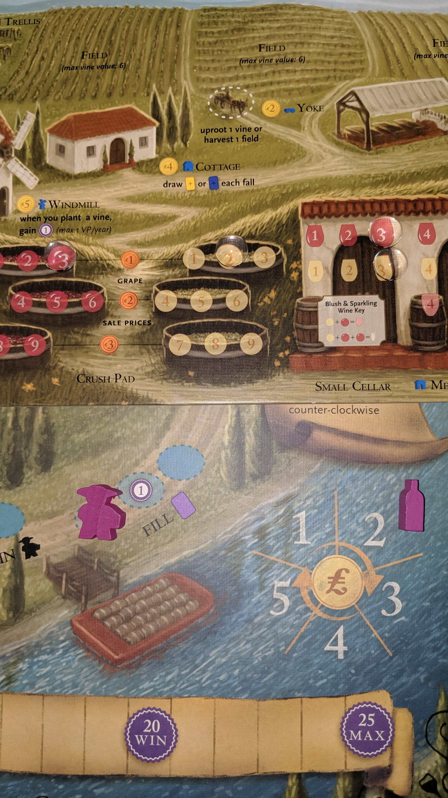

---?image=images/0.jpg&size=85% 85%&color=black

---

@snap[north-west span-50]
@color[red](Version) 
@color[blue](0.0.9)
@ol[list-bullets-black](false)
@olend

@snapend

@snap[north-east span-50]

@snapend

---

@snap[north-west span-50]
@color[red](How to Play) 
@color[blue](Grow and sell wine to earn the most reputation (20VP).)
@ol[list-bullets-black](false)
@olend

@snapend

@snap[north-east span-50]

@snapend

---

@snap[north-west span-50]
@color[red]() 
@color[blue](Quick Terms)
@ol[list-bullets-black](false)
@olend

@snapend

@snap[north-east span-50]

@snapend

---

@snap[north-west span-50]
@color[red](Quick Terms) 
@color[blue](Fields)
@ol[list-bullets-black](false)
- Holds Vines.
@olend

@snapend

@snap[north-east span-50]

@snapend

---

@snap[north-west span-50]
@color[red](Quick Terms) 
@color[blue](Vines)
@ol[list-bullets-black](false)
- Produces grapes.
@olend

@snapend

@snap[north-east span-50]

@snapend

---

@snap[north-west span-50]
@color[red](Quick Terms) 
@color[blue](Crush Pad)
@ol[list-bullets-black](false)
- Holds Grapes.
@olend

@snapend

@snap[north-east span-50]

@snapend

---

@snap[north-west span-50]
@color[red](Quick Terms) 
@color[blue](Cellar)
@ol[list-bullets-black](false)
- Holds wine.
@olend

@snapend

@snap[north-east span-50]

@snapend

---

@snap[north-west span-50]
@color[red](Quick Terms) 
@color[blue](Orders)
@ol[list-bullets-black](false)
- Sell wine.
@olend

@snapend

@snap[north-east span-50]

@snapend

---

@snap[north-west span-50]
@color[red](Quick Terms) 
@color[blue](Visitors)
@ol[list-bullets-black](false)
- Provides actions or rewards.
@olend

@snapend

@snap[north-east span-50]

@snapend

---

@snap[north-west span-50]
@color[red](Quick Terms) 
@color[blue](Workers)
@ol[list-bullets-black](false)
- Used to claim available actions.
@olend

@snapend

@snap[north-east span-50]

@snapend

---

@snap[north-west span-50]
@color[red](Quick Terms) 
@color[blue](El Grande)
@ol[list-bullets-black](false)
- Same as Worker, also can be placed on a filled action space but no bonuses gained.
@olend

@snapend

@snap[north-east span-50]

@snapend

---

@snap[north-west span-50]
@color[red](Quick Terms) 
@color[blue](Residual Payments)
@ol[list-bullets-black](false)
- Earned when filling orders.
- Collected at EOY.
- Max 5.
@olend

@snapend

@snap[north-east span-50]

@snapend

---

@snap[north-west span-50]
@color[red]() 
@color[blue](Phases)
@ol[list-bullets-black](false)
@olend

@snapend

@snap[north-east span-50]

@snapend

---

@snap[north-west span-50]
@color[red](Phases) 
@color[blue](Spring)
@ol[list-bullets-black](false)
@olend

@snapend

@snap[north-east span-50]

@snapend

---

@snap[north-west span-50]
@color[red](Phases: Spring) 
@color[blue](Wake Up.)
@ol[list-bullets-black](false)
- From first player, clockwise.
- Place Rooster on the Wake Up chart.
- Dictates player order and benefits received.
@olend

@snapend

@snap[north-east span-50]

@snapend

---

@snap[north-west span-50]
@color[red](Phases) 
@color[blue](Summer)
@ol[list-bullets-black](false)
- In Wake Up order.
- Place 1 worker on an available Summer action space (yellow)
- Each action space has 1 bonus slot
- Pass and save remaining workers for Winter.
@olend

@snapend

@snap[north-east span-50]

@snapend

---

@snap[north-west span-50]
@color[red](Phases) 
@color[blue](Fall)
@ol[list-bullets-black](false)
- In Wake Up order.
- Draw one Visitor card.
- Summer (yellow)
- Winter (blue)
@olend

@snapend

@snap[north-east span-50]

@snapend

---

@snap[north-west span-50]
@color[red](Phases) 
@color[blue](Winter)
@ol[list-bullets-black](false)
- In Wake Up order.
- Place 1 worker on an available Winter action space (blue).
- Each action space has 1 bonus slot
- Gain $1 always available
@olend

@snapend

@snap[north-east span-50]

@snapend

---

@snap[north-west span-50]
@color[red](Phases) 
@color[blue](EOR)
@ol[list-bullets-black](false)
- Age Grapes and Wines.
- Return Workers and Rooster.
- Collect Residuals.
- Rotate Starting Player counter clockwise.
- Check EOG.
@olend

@snapend

@snap[north-east span-50]

@snapend

---

@snap[north-west span-50]
@color[red](Phases) 
@color[blue](EOG)
@ol[list-bullets-black](false)
- Once a player has reached 20+VP.
@olend

@snapend

@snap[north-east span-50]

@snapend

---

@snap[north-west span-50]
@color[red]() 
@color[blue](Field's Value)
@ol[list-bullets-black](false)
- Total value of red and white vines
- You'll be able to buy one 5, 6, and 7 value field.
@olend

@snapend

@snap[north-east span-50]

@snapend

---

@snap[north-west span-50]
@color[red]() 
@color[blue](Vines)
@ol[list-bullets-black](false)
- Color
- Value(s): where it starts on Crush Pad
- Multiple Vine Cards add to red and/or white total
- May be harvested once a year
@olend

@snapend

@snap[north-east span-50]

@snapend

---

@snap[north-west span-50]
@color[red](Vines: Types) 
@color[blue](CARDS)
@ol[list-bullets-black](false)
-  4 Red and 4 White 1 value vines.
-  6 Red and White 1 value vines (Trellis).
-  5 Red and 5 White 2 value vines (Trellis).
-  5 Red and 5 White 3 value vines (Irrigation).
-  4 Red and 4 White 4 value vines (T & I).
@olend

@snapend

@snap[north-east span-50]

@snapend

---

@snap[north-west span-50]
@color[red]() 
@color[blue](Devalue / Overvalue)
@ol[list-bullets-black](false)
@olend

@snapend

@snap[north-east span-50]

@snapend

---

@snap[north-west span-50]
@color[red](Devalue / Overvalue) 
@color[blue](Devalue Grape/Wine(s))
@ol[list-bullets-black](false)
- If you earn a level 4 grape/wine
- And you already have a level 4 grape/wine
- You may still add it as the next available lower value
@olend

@snapend

@snap[north-east span-50]

@snapend

---

@snap[north-west span-50]
@color[red](Devalue / Overvalue) 
@color[blue](Devalue Cellar limit)
@ol[list-bullets-black](false)
- If you earn a level 5 grape/wine
- But don't have the corresponding cellar
- You may still add it as the next available lower value
@olend

@snapend

@snap[north-east span-50]

@snapend

---

@snap[north-west span-50]
@color[red](Devalue / Overvalue) 
@color[blue](Overvalued Wine(s))
@ol[list-bullets-black](false)
- If you need to fill an order with a level 4 wine
- And you don't have a level 4 wine
- You may still fill the order with the next available higher value wine
@olend

@snapend

@snap[north-east span-50]

@snapend

---

@snap[north-west span-50]
@color[red]() 
@color[blue](Structures)
@ol[list-bullets-black](false)
@olend

@snapend

@snap[north-east span-50]

@snapend

---

@snap[north-west span-50]
@color[red](Structures) 
@color[blue]($2 Trellis)
@ol[list-bullets-black](false)
- Requirement for certain vines.
@olend

@snapend

@snap[north-east span-50]

@snapend

---

@snap[north-west span-50]
@color[red](Structures) 
@color[blue]($3 Irrigation)
@ol[list-bullets-black](false)
- Requirement for certain vines.
@olend

@snapend

@snap[north-east span-50]

@snapend

---

@snap[north-west span-50]
@color[red](Structures) 
@color[blue]($5 Windmill)
@ol[list-bullets-black](false)
- Collect 1VP per future planted vines.
@olend

@snapend

@snap[north-east span-50]

@snapend

---

@snap[north-west span-50]
@color[red](Structures) 
@color[blue]($2 Yoke)
@ol[list-bullets-black](false)
- Acts as 1 action space for Summer OR Winter.
- Allows you to Uproot 1 Vine.
- Harvest 1 Field.
@olend

@snapend

@snap[north-east span-50]

@snapend

---

@snap[north-west span-50]
@color[red](Structures) 
@color[blue]($6 Tasting Room)
@ol[list-bullets-black](false)
- Collect 1VP per future Wine tour.
- If you have at least 1 wine.
@olend

@snapend

@snap[north-east span-50]

@snapend

---

@snap[north-west span-50]
@color[red](Structures) 
@color[blue]($4/$6 Cellars)
@ol[list-bullets-black](false)
- Medium/Large.
- Stores additional, higher valued wine.
@olend

@snapend

@snap[north-east span-50]

@snapend

---

@snap[north-west span-50]
@color[red](Structures) 
@color[blue]($4 Cottage)
@ol[list-bullets-black](false)
- Draw 1 extra Fall Visitor card.
@olend

@snapend

@snap[north-east span-50]

@snapend

---

@snap[north-west span-50]
@color[red]() 
@color[blue](Worker Placement)
@ol[list-bullets-black](false)
- Actions for Summer.
- Actions for Winter.
- Must be able to resolve action to take it.
- Bonuses are optional.
@olend

@snapend

@snap[north-east span-50]

@snapend

---

@snap[north-west span-50]
@color[red]() 
@color[blue](Summer Worker Placement)
@ol[list-bullets-black](false)
@olend

@snapend

@snap[north-east span-50]

@snapend

---

@snap[north-west span-50]
@color[red](Summer Worker Placement) 
@color[blue](Gain $1)
@ol[list-bullets-black](false)
- Available in Summer or Winter.
- No worker limit.
@olend

@snapend

@snap[north-east span-50]

@snapend

---

@snap[north-west span-50]
@color[red](Summer Worker Placement) 
@color[blue](Draw Vine Card)
@ol[list-bullets-black](false)
- BONUS: draw second vine card.
@olend

@snapend

@snap[north-east span-50]

@snapend

---

@snap[north-west span-50]
@color[red](Summer Worker Placement) 
@color[blue](Plant Vine Card)
@ol[list-bullets-black](false)
- Play where it won't exceed the field limit.
- Keep values visible.
- You will eventually produce 1 red and/or 1 white from vine totals.
- BONUS: plant second vine card.
@olend

@snapend

@snap[north-east span-50]

@snapend

---

@snap[north-west span-50]
@color[red](Summer Worker Placement) 
@color[blue](Uproot)
@ol[list-bullets-black](false)
- Action from Visitor Cards or Yoke.
- Take one planted field back into your hand.
@olend

@snapend

@snap[north-east span-50]

@snapend

---

@snap[north-west span-50]
@color[red](Summer Worker Placement) 
@color[blue](Summer Visitor (yellow))
@ol[list-bullets-black](false)
- Must be able to resolve visitor card.
- BONUS: resolve second Summer Visitor card.
@olend

@snapend

@snap[north-east span-50]

@snapend

---

@snap[north-west span-50]
@color[red](Summer Worker Placement) 
@color[blue]($2 Vineyard Tour)
@ol[list-bullets-black](false)
- BONUS: gain $1.
@olend

@snapend

@snap[north-east span-50]

@snapend

---

@snap[north-west span-50]
@color[red](Summer Worker Placement) 
@color[blue](Build Structure)
@ol[list-bullets-black](false)
- BONUS: gain $1.
@olend

@snapend

@snap[north-east span-50]

@snapend

---

@snap[north-west span-50]
@color[red](Summer Worker Placement) 
@color[blue](Sell Grapes OR Buy/Sell 1 Field)
@ol[list-bullets-black](false)
- Sell any grape from Crush Pad for it's row's value.
- OR buy a field card.
- OR sell back a field card (unless it has vines).
- BONUS: gain 1VP.
@olend

@snapend

@snap[north-east span-50]

@snapend

---

@snap[north-west span-50]
@color[red]() 
@color[blue](Winter Worker Placement)
@ol[list-bullets-black](false)
@olend

@snapend

@snap[north-east span-50]

@snapend

---

@snap[north-west span-50]
@color[red](Winter Worker Placement) 
@color[blue](Gain $1)
@ol[list-bullets-black](false)
- Available in Summer or Winter.
- No worker limit.
@olend

@snapend

@snap[north-east span-50]

@snapend

---

@snap[north-west span-50]
@color[red](Winter Worker Placement) 
@color[blue](Draw 1 Wine Order Card (purple))
@ol[list-bullets-black](false)
- BONUS: Draw an additional Wine Order Card.
@olend

@snapend

@snap[north-east span-50]

@snapend

---

@snap[north-west span-50]
@color[red](Winter Worker Placement) 
@color[blue](Harvest 1 field)
@ol[list-bullets-black](false)
- Choose 1 field to produce grapes based on vine values.
- Vine Cards stay on field.
- BONUS: Harvest an additional field.
@olend

@snapend

@snap[north-east span-50]

@snapend

---

@snap[north-west span-50]
@color[red](Winter Worker Placement) 
@color[blue](Pay $4 to train 1 worker)
@ol[list-bullets-black](false)
- Place new worker on this space.
- Will be picked up at EOY.
- BONUS: Gain $1.
@olend

@snapend

@snap[north-east span-50]

@snapend

---

@snap[north-west span-50]
@color[red](Winter Worker Placement) 
@color[blue](Play 1 Winter Visitor Card (blue))
@ol[list-bullets-black](false)
- Must be able to resolve visitor card.
- BONUS: resolve second Winter Visitor card.
@olend

@snapend

@snap[north-east span-50]

@snapend

---

@snap[north-west span-50]
@color[red](Winter Worker Placement) 
@color[blue](Make up to 2 Wine Tokens)
@ol[list-bullets-black](false)
- Convert Crush Pad Grapes to Wines.
- Level 4 Grape converts to level 4 Wine.
- Wines that require two or three grapes equal sum of grapes.
- BONUS: Make 1 extra Wine Token
@olend

@snapend

@snap[north-east span-50]

@snapend

---

@snap[north-west span-50]
@color[red](Winter Worker Placement) 
@color[blue](Fill 1 Wine Order)
@ol[list-bullets-black](false)
- Some Visitor cards allow this action.
- Must be able to resolve order card.
- Discard used Wine token.
- BONUS: Gain $1
@olend

@snapend

@snap[north-east span-50]

@snapend

---

@snap[north-west span-50]
@color[red](Winter Worker Placement: Fill 1 Wine Order) 
@color[blue](Wine Order Card)
@ol[list-bullets-black](false)
- Required Wine(s) value.
- VP Earned.
- Increase Residual Payment icon.
@olend

@snapend

@snap[north-east span-50]

@snapend

---

@snap[north-west span-50]
@color[red]() 
@color[blue](EOY)
@ol[list-bullets-black](false)
- If room, increase all Wines and Grapes by 1.
- Collect Workers.
- Collect Residual Payments.
- Discard down to 7 cards.
- Rotate first player counter-clockwise.
@olend

@snapend

@snap[north-east span-50]

@snapend

---

@snap[north-west span-50]
@color[red]() 
@color[blue](Winning)
@ol[list-bullets-black](false)
- Highest VP.
@olend

@snapend

@snap[north-east span-50]

@snapend

---

@snap[north-west span-50]
@color[red](Winning) 
@color[blue](Tiebreakers...)
@ol[list-bullets-black](false)
- Most money.
- Highest value of wine in Cellar.
- Highest value of grapes in Crush Pad.
@olend

@snapend

@snap[north-east span-50]

@snapend

---

@snap[north-west span-50]
@color[red]() 
@color[blue](Thank You)
@ol[list-bullets-black](false)
