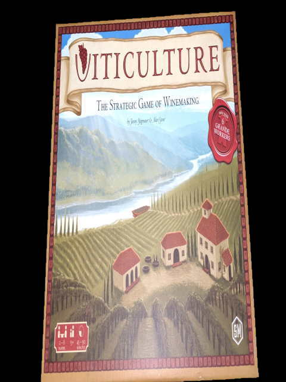
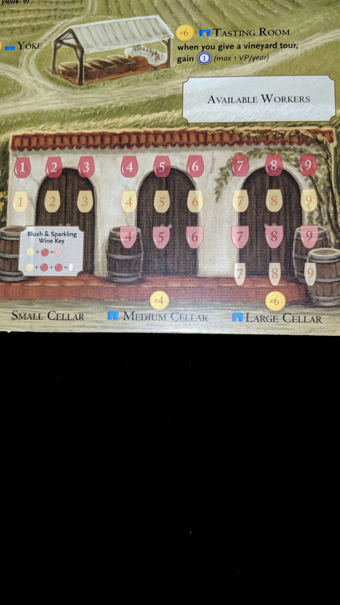
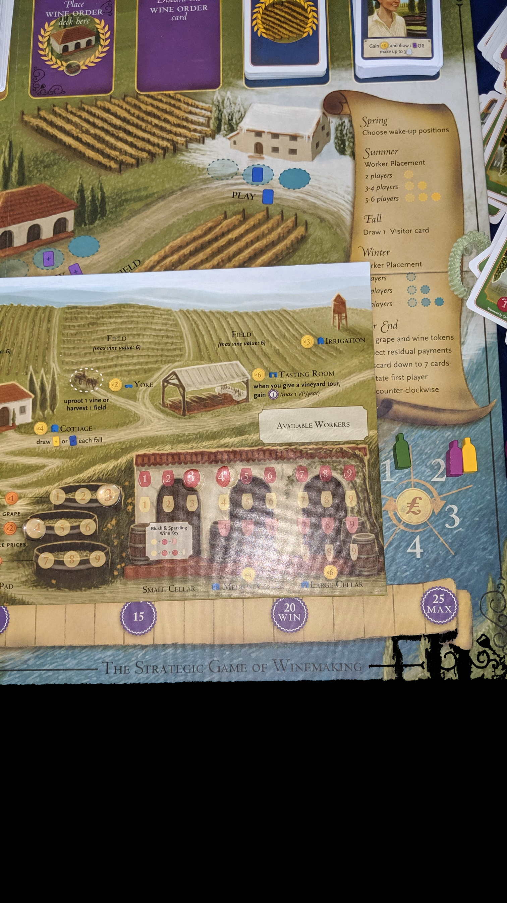
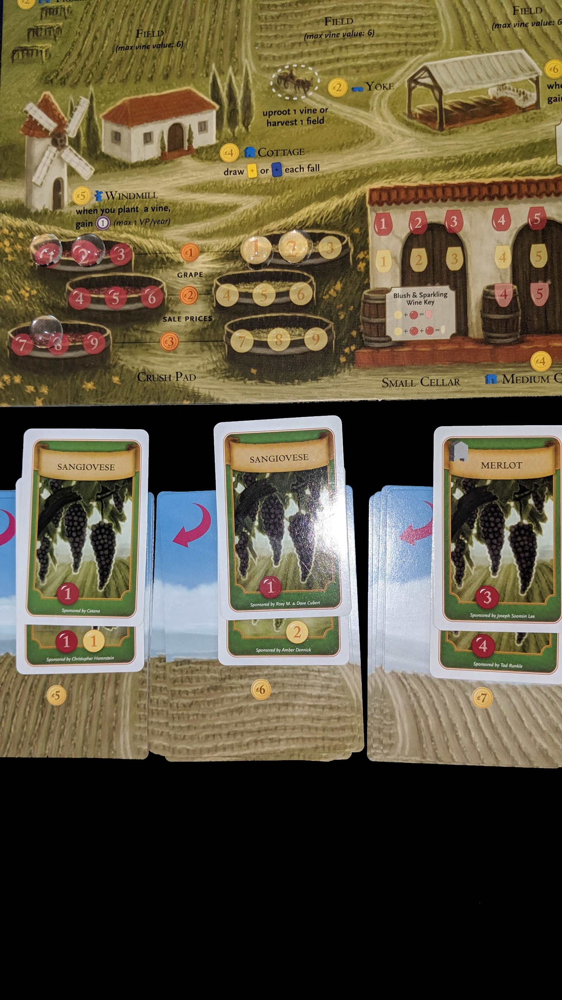

---?image=images/0.jpg&size=85% 85%&color=black

---

@snap[north-west span-50]
@color[red](Version) 
@color[blue](0.0.1)
@ol[list-bullets-black](false)
@olend

@snapend

@snap[north-east span-50]

@snapend

---

@snap[north-west span-50]
@color[red](RootTitle) 
@color[blue](Header)
@ol[list-bullets-black](false)
- List item
@olend

@snapend

@snap[north-east span-50]

@snapend

---

@snap[north-west span-50]
@color[red](RootTitle: SubTitle) 
@color[blue](header)
@ol[list-bullets-black](false)
- List item
@olend

@snapend

@snap[north-east span-50]

@snapend

---

@snap[north-west span-50]
@color[red](RootTitle: SubTitle: SubSubTitle) 
@color[blue](subheader)
@ol[list-bullets-black](false)
- list item
@olend

@snapend

@snap[north-east span-50]

@snapend

---

@snap[north-west span-50]
@color[red](How to Play) 
@color[blue](Through diplomacy and war become the strongest house in Westeros.)
@ol[list-bullets-black](false)
@olend

@snapend

@snap[north-east span-50]

@snapend

---

@snap[north-west span-50]
@color[red](Quick Terms:) 
@color[blue]()
@ol[list-bullets-black](false)
@olend

@snapend

@snap[north-east span-50]

@snapend

---

@snap[north-west span-50]
@color[red]() 
@color[blue](Phases)
@ol[list-bullets-black](false)
- Westeros
- Planning
- Action
@olend

@snapend

@snap[north-east span-50]

@snapend

---

@snap[north-west span-50]
@color[red](Phases) 
@color[blue](Westeros)
@ol[list-bullets-black](false)
- Advance Round Marker
- Draw Westeros Cards
- Advance Wildlings Track
- Resolve Westeros Cards
@olend

@snapend

@snap[north-east span-50]

@snapend

---

@snap[north-west span-50]
@color[red](Phases: Westeros: Advance Round Marker) 
@color[blue](Game ends after round 10.)
@ol[list-bullets-black](false)
@olend

@snapend

@snap[north-east span-50]

@snapend

---

@snap[north-west span-50]
@color[red](Phases: Westeros: Draw Westeros Cards) 
@color[blue](Reveal top card for all three decks.)
@ol[list-bullets-black](false)
- Wait
@olend

@snapend

@snap[north-east span-50]

@snapend

---

@snap[north-west span-50]
@color[red](Phases: Westeros: Advance Wildlings Track) 
@color[blue](Per Wildling Icon, advance track.)
@ol[list-bullets-black](false)
- Ignore any Icons moving it over 12.
- If at 12, immediatley resolve Wildling Attack.
@olend

@snapend

@snap[north-east span-50]

@snapend

---

@snap[north-west span-50]
@color[red](Phases: Westeros: Advance Wildlings Track: Wildling Attack) 
@color[blue](Wildling Strength = track number.)
@ol[list-bullets-black](false)
- Players siliently bid Power Tokens.
- Night's Watch wins if Power Tolens > Wilding Strength.
@olend

@snapend

@snap[north-east span-50]

@snapend

---

@snap[north-west span-50]
@color[red](Phases: Westeros: Advance Wildlings Track: Wildling Attack) 
@color[blue](Reset Wildling Track)
@ol[list-bullets-black](false)
- Return to 0 on Night's watch win.
- Move back 2 spaces on loss
@olend

@snapend

@snap[north-east span-50]

@snapend

---

@snap[north-west span-50]
@color[red](Phases: Westeros: Advance Wildlings Track: Wildling Attack) 
@color[blue](Reveal top Wildling card. Contains rewards or penalties.)
@ol[list-bullets-black](false)
- Night's Watch Victory reward goes to highest Power Bidder.
@olend

@snapend

@snap[north-east span-50]

@snapend

---

@snap[north-west span-50]
@color[red](Phases: Westeros: Resolve Westeros Cards) 
@color[blue](Resolve from deck 1-3)
@ol[list-bullets-black](false)
- Affects game/round
- May Supply, Muster, Clash of Kings
@olend

@snapend

@snap[north-east span-50]

@snapend

---

@snap[north-west span-50]
@color[red](Phases: Westeros: Resolve Westeros Cards: Resolve Westeros Cards) 
@color[blue](Supply)
@ol[list-bullets-black](false)
- In turn order. (or not for speed)
- Re-Defines how much army you can afford.
- Armies are 2+ units together.
- Move player barrel to match controlled supply icons.
@olend

@snapend

@snap[north-east span-50]

@snapend

---

@snap[north-west span-50]
@color[red](Phases: Westeros: Resolve Westeros Cards: Supply) 
@color[blue](Flags 4 / 3 / 2 / 2)
@ol[list-bullets-black](false)
- Show's you can have a 4 unit army
- Three unit army
- Two unit army
- Two unit army
- As many 1 units as you want.
@olend

@snapend

@snap[north-east span-50]

@snapend

---

@snap[north-west span-50]
@color[red](Phases: Westeros: Resolve Westeros Cards) 
@color[blue](Supply)
@ol[list-bullets-black](false)
- If you're now over a limit
- Remove units from board until you're valid.
@olend

@snapend

@snap[north-east span-50]

@snapend

---

@snap[north-west span-50]
@color[red](Phases: Westeros: Resolve Westeros Cards: Resolve Westeros Cards) 
@color[blue](Muster)
@ol[list-bullets-black](false)
- In turn order. (or not for speed)
- Recruit more unused units.
- No change, no savings.
@olend

@snapend

@snap[north-east span-50]

@snapend

---

@snap[north-west span-50]
@color[red](Phases: Westeros: Resolve Westeros Cards: Muster) 
@color[blue](Income)
@ol[list-bullets-black](false)
- Stronghold gives $2 on it.
- Castle gives $1 on it.
- Stay within Supply limits.
@olend

@snapend

@snap[north-east span-50]

@snapend

---

@snap[north-west span-50]
@color[red](Phases: Westeros: Resolve Westeros Cards: Muster) 
@color[blue](Costs)
@ol[list-bullets-black](false)
- Footman $1
- Knight $2, upgrade footman $1
- Ship $1, place in adjacent Port or Sea space.
- Siege Engine $2, upgrade footman $1
@olend

@snapend

@snap[north-east span-50]

@snapend

---

@snap[north-west span-50]
@color[red](Phases: Westeros: Resolve Westeros Cards: Resolve Westeros Cards) 
@color[blue](Clash of Kings)
@ol[list-bullets-black](false)
- Hide Power Tokens.
- Silently bid for order per track.
- Ties decided by owner of Iron Throne Token.
@olend

@snapend

@snap[north-east span-50]

@snapend

---

@snap[north-west span-50]
@color[red](Phases: Westeros: Resolve Westeros Cards) 
@color[blue](Clash of Kings)
@ol[list-bullets-black](false)
- Top to Bottom, earning Reward Token after each.
- Discard Used Power Tokens
- Place unused Power Tokens in front of screen.
@olend

@snapend

@snap[north-east span-50]

@snapend

---

@snap[north-west span-50]
@color[red](Phases: Westeros: Resolve Westeros Cards: Clash of Kings) 
@color[blue](Iron Throne Track)
@ol[list-bullets-black](false)
- Defines turn order.
- Reward Throne = all tie-breaking (not battles).
@olend

@snapend

@snap[north-east span-50]

@snapend

---

@snap[north-west span-50]
@color[red](Phases: Westeros: Resolve Westeros Cards: Clash of Kings) 
@color[blue](Fiefdom Track)
@ol[list-bullets-black](false)
- Order breaks battle ties.
- Reward Sword = +1 battles.
@olend

@snapend

@snap[north-east span-50]

@snapend

---

@snap[north-west span-50]
@color[red](Phases: Westeros: Resolve Westeros Cards: Clash of Kings) 
@color[blue](King's Court Track)
@ol[list-bullets-black](false)
- Defines how many Special Order Tokens that are usable to you.
- Rewards Raven = Replace one Order Token
- OR Look at top Wildling Deck. Return to top or bottom.
@olend

@snapend

@snap[north-east span-50]

@snapend

---

@snap[north-west span-50]
@color[red](Phases: Planning) 
@color[blue](Assign)
@ol[list-bullets-black](false)
- Assign Order Tokens facedown.
- One per unit(s) controlled territory.
- Special Order Tokens have stars.
@olend

@snapend

@snap[north-east span-50]

@snapend

---

@snap[north-west span-50]
@color[red](Phases: Planning: Order Tokens) 
@color[blue](Will resolve by token type.)
@ol[list-bullets-black](false)
- Raid
- March
- Defense
- Support
- Consolidate Power
@olend

@snapend

@snap[north-east span-50]

@snapend

---

@snap[north-west span-50]
@color[red](Phases: Planning: Order Tokens) 
@color[blue](Raid)
@ol[list-bullets-black](false)
- Remove adjacent Raid, Support, Consolidate Power
- Special = or remove Defense.
@olend

@snapend

@snap[north-east span-50]

@snapend

---

@snap[north-west span-50]
@color[red](Phases: Planning: Order Tokens) 
@color[blue](March)
@ol[list-bullets-black](false)
- Per unit, move to adjacent territory.
- Triggers battle with enemy units.
- Only One pattle per token.
- Special = +1 battle for attacker.
@olend

@snapend

@snap[north-east span-50]

@snapend

---

@snap[north-west span-50]
@color[red](Phases: Planning: Order Tokens) 
@color[blue](Defense)
@ol[list-bullets-black](false)
- Adds it's defense bonus in territory.
- As many times as it's attacked.
- Special = +2 battle for defender.
@olend

@snapend

@snap[north-east span-50]

@snapend

---

@snap[north-west span-50]
@color[red](Phases: Planning: Order Tokens) 
@color[blue](Support)
@ol[list-bullets-black](false)
- Per unit, add's unit strength to adjacent territory.
- Support Attacker or Defender.
- Special = +1 support value.
@olend

@snapend

@snap[north-east span-50]

@snapend

---

@snap[north-west span-50]
@color[red](Phases: Planning: Order Tokens) 
@color[blue](Consolidate Power)
@ol[list-bullets-black](false)
- Gain 1 Power Token.
- +1 per power icon of territory.
- Nothing for seas, but misdirection.
- Special = OR muster the territory.
@olend

@snapend

@snap[north-east span-50]

@snapend

---

@snap[north-west span-50]
@color[red](Phases: Planning) 
@color[blue](Once order tokens are placed.)
@ol[list-bullets-black](false)
- Reveal
- Use Raven, once per round.
@olend

@snapend

@snap[north-east span-50]

@snapend

