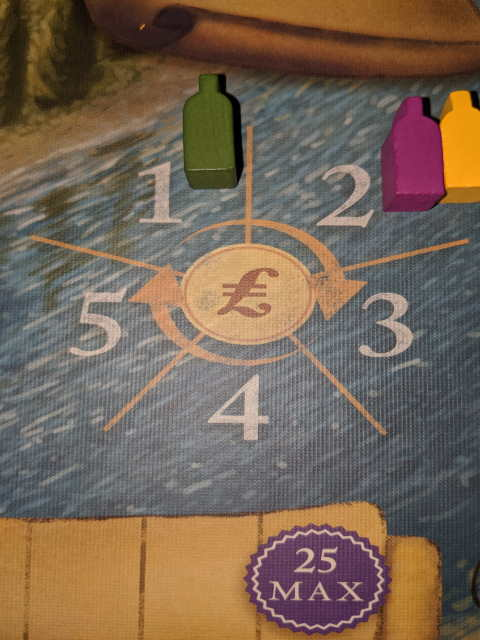
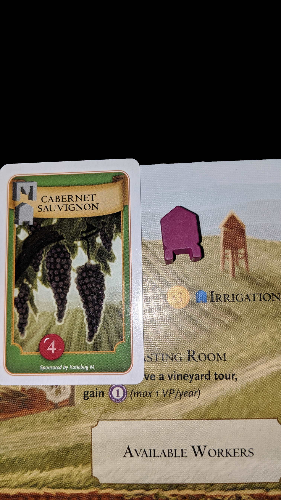
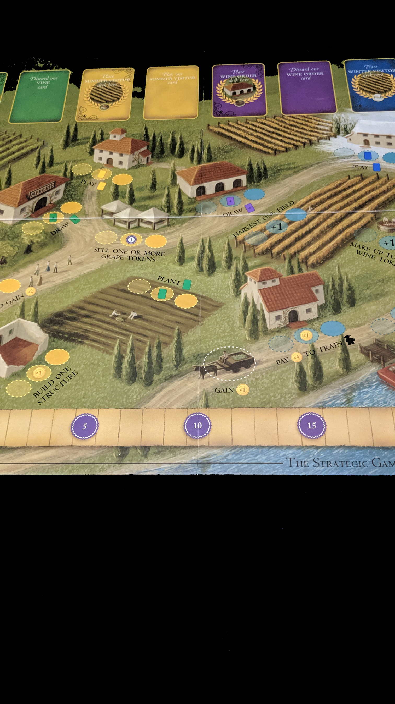

---?image=images/0.jpg&size=85% 85%&color=black

---

@snap[north-west span-50]
@color[red](How to Play) 
@color[blue](Through battle expand your empire to 5 external planets.)
@ol[list-bullets-black](false)
@olend

@snapend

@snap[north-east span-50]

@snapend

---

@snap[north-west span-50]
@color[red](Quick Terms: Timestrip) 
@color[blue](Bottom of card, shows what phase it may be played in.)
@ol[list-bullets-black](false)
- You're expected to interrupt within a reasonable time.
@olend

@snapend

@snap[north-east span-50]

@snapend

---

@snap[north-west span-50]
@color[red](Quick Terms: Warp) 
@color[blue](Where defeated ships go.)
@ol[list-bullets-black](false)
@olend

@snapend

@snap[north-east span-50]

@snapend

---

@snap[north-west span-50]
@color[red](Quick Terms: Gate) 
@color[blue](Points to attacked Planet.)
@ol[list-bullets-black](false)
@olend

@snapend

@snap[north-east span-50]

@snapend

---

@snap[north-west span-50]
@color[red](Quick Terms: Planet) 
@color[blue](Keeps ships.)
@ol[list-bullets-black](false)
@olend

@snapend

@snap[north-east span-50]

@snapend

---

@snap[north-west span-50]
@color[red](Quick Terms: Battle Strength) 
@color[blue](Ships + Encounter Card + Reinforement Cards + Modifiers.)
@ol[list-bullets-black](false)
@olend

@snapend

@snap[north-east span-50]

@snapend

---

@snap[north-west span-50]
@color[red](Quick Terms: ) 
@color[blue](.)
@ol[list-bullets-black](false)
@olend

@snapend

@snap[north-east span-50]

@snapend

---

@snap[north-west span-50]
@color[red](Active Player) 
@color[blue](Play continues left.)
@ol[list-bullets-black](false)
- One encounter.
- Optional second, if first one was successful.
@olend

@snapend

@snap[north-east span-50]

@snapend

---

@snap[north-west span-50]
@color[red](Encounter) 
@color[blue](Actions)
@ol[list-bullets-black](false)
- Regroup
- Destiny
- Launch
- Alliance
- Planning
- Reveal
- Resolution
@olend

@snapend

@snap[north-east span-50]

@snapend

---

@snap[north-west span-50]
@color[red](Encounter: Regroup) 
@color[blue](Retrieve ship from Warp)
@ol[list-bullets-black](false)
- Place on Gate if no Planets
@olend

@snapend

@snap[north-east span-50]

@snapend

---

@snap[north-west span-50]
@color[red](Encounter: Regroup: No Encounter Cards) 
@color[blue](Play or discard any remaing cards.)
@ol[list-bullets-black](false)
- Draw 8 cards.
@olend

@snapend

@snap[north-east span-50]

@snapend

---

@snap[north-west span-50]
@color[red](Encounter: Destiny) 
@color[blue](Shows players action.)
@ol[list-bullets-black](false)
- Offense draws top card.
- If one card, reshuffle first.
@olend

@snapend

@snap[north-east span-50]

@snapend

---

@snap[north-west span-50]
@color[red](Encounter: Destiny) 
@color[blue](Types)
@ol[list-bullets-black](false)
- Other's Color
- Own Color
- Wild
- Special
@olend

@snapend

@snap[north-east span-50]

@snapend

---

@snap[north-west span-50]
@color[red](Encounter: Destiny: Types: Other's Color) 
@color[blue](Indicates where attack happens.)
@ol[list-bullets-black](false)
@olend

@snapend

@snap[north-east span-50]

@snapend

---

@snap[north-west span-50]
@color[red](Encounter: Destiny: Types: Own's Color) 
@color[blue](May draw again.)
@ol[list-bullets-black](false)
- Can choose own Planet and become defender.
- If 0 ships, auto-success.
@olend

@snapend

@snap[north-east span-50]

@snapend

---

@snap[north-west span-50]
@color[red](Encounter: Destiny: Types: Wild) 
@color[blue](Choose any player to attack.)
@ol[list-bullets-black](false)
@olend

@snapend

@snap[north-east span-50]

@snapend

---

@snap[north-west span-50]
@color[red](Encounter: Destiny: Types: Special) 
@color[blue](List conditions that define where attack happens.)
@ol[list-bullets-black](false)
@olend

@snapend

@snap[north-east span-50]

@snapend

---

@snap[north-west span-50]
@color[red](Encounter) 
@color[blue](Launch)
@ol[list-bullets-black](false)
- Point Gate at specific Planet.
- Add 1-4 own ships to Gate.
- Ships can come from home, or external Planet.
@olend

@snapend

@snap[north-east span-50]

@snapend

---

@snap[north-west span-50]
@color[red](Encounter: Alliance) 
@color[blue](Attacker announce permitted allies.)
@ol[list-bullets-black](false)
- Defender announce permitted allies (may overlap).
@olend

@snapend

@snap[north-east span-50]

@snapend

---

@snap[north-west span-50]
@color[red](Encounter: Alliance: Left to Right) 
@color[blue](choose side or pass.)
@ol[list-bullets-black](false)
- Adds 1-4 ships to side.
- Ships can come from home, or external Planet.
@olend

@snapend

@snap[north-east span-50]

@snapend

---

@snap[north-west span-50]
@color[red](Encounter: Planning) 
@color[blue](Attacker and Defender chooses an Encounter Card face down.)
@ol[list-bullets-black](false)
- Encounter Card = Attack, Negotiate, or Morph.
@olend

@snapend

@snap[north-east span-50]

@snapend

---

@snap[north-west span-50]
@color[red](Encounter: Planning) 
@color[blue](If Defender has no Encounter cards)
@ol[list-bullets-black](false)
- May reveal non Encounter cards
- Discard all.
- Draw 8.
@olend

@snapend

@snap[north-east span-50]

@snapend

---

@snap[north-west span-50]
@color[red](Encounter: Planning) 
@color[blue](If Attacker has no Encounter cards)
@ol[list-bullets-black](false)
- End Turn.
- All ships return to any ownded Planet.
@olend

@snapend

@snap[north-east span-50]

@snapend

---

@snap[north-west span-50]
@color[red](Encounter: Reveal) 
@color[blue](Flip both cards.)
@ol[list-bullets-black](false)
@olend

@snapend

@snap[north-east span-50]

@snapend

---

@snap[north-west span-50]
@color[red](Encounter: Reveal: Possibly) 
@color[blue](2 attack cards.)
@ol[list-bullets-black](false)
- 1 attack, 1 negotiate.
- 2 negotiate.
- Morph card mimics opposite.
- Only 1 Morph card.
@olend

@snapend

@snap[north-east span-50]

@snapend

---

@snap[north-west span-50]
@color[red](Encounter: Reveal: Possibly: 2 Attack Cards.) 
@color[blue](Total = ships on side + Attack card value (1-30).)
@ol[list-bullets-black](false)
- Ties go to the Defender.
- May play interrupt cards.
@olend

@snapend

@snap[north-east span-50]

@snapend

---

@snap[north-west span-50]
@color[red](Encounter: Reveal: Possibly: 2 Attack Cards.: Interrupte Cards) 
@color[blue](Artifact = Powerful Items.)
@ol[list-bullets-black](false)
- Reinforcement = adds to battle strength.
- Flare / Super Flare...
@olend

@snapend

@snap[north-east span-50]

@snapend

---

@snap[north-west span-50]
@color[red](Encounter: Reveal: Possibly: 2 Attack Cards.: Interrupte Cards: Flare / Super Flare) 
@color[blue](May be played once per encounter.)
@ol[list-bullets-black](false)
- Will be returned to your hand.
- It's a Super Flare if it's of your Alien.
- Zapped Alien powers reduces to Flare.
@olend

@snapend

@snap[north-east span-50]

@snapend

---

@snap[north-west span-50]
@color[red](Encounter: Reveal: Possibly: 1 Attack, 1 Negotiate) 
@color[blue](Negotiater auto-loses, but get's compensation.)
@ol[list-bullets-black](false)
@olend

@snapend

@snap[north-east span-50]

@snapend

---

@snap[north-west span-50]
@color[red](Encounter: Reveal: Possibly: 1 Attack, 1 Negotiate: Compensation) 
@color[blue](Per ship, draw a random card from Attacker's hand.)
@ol[list-bullets-black](false)
- Stops if Attacker runs out of cards.
@olend

@snapend

@snap[north-east span-50]

@snapend

---

@snap[north-west span-50]
@color[red](Encounter: Reveal: Possibly: 2 Negotiate) 
@color[blue](1 minute to make deal.)
@ol[list-bullets-black](false)
- Allies get ships back.
@olend

@snapend

@snap[north-east span-50]

@snapend

---

@snap[north-west span-50]
@color[red](Encounter: Reveal: Possibly: 2 Negotiate: Deal Types) 
@color[blue](May trade cards / allow the other's ship to land on Planet.)
@ol[list-bullets-black](false)
- May land any ship not in Warp.
@olend

@snapend

@snap[north-east span-50]

@snapend

---

@snap[north-west span-50]
@color[red](Encounter: Reveal: Possibly: 2 Negotiate: End of Negotiate) 
@color[blue](Return ships to any Planet.)
@ol[list-bullets-black](false)
- Must trade something, or both lose 3 ships to Warp.
@olend

@snapend

@snap[north-east span-50]

@snapend

---

@snap[north-west span-50]
@color[red](Encounter: Resolution) 
@color[blue](Discard revealed cards.)
@ol[list-bullets-black](false)
- Return Flare cards to hand.
- Attacker Wins
- Attacker Loses
@olend

@snapend

@snap[north-east span-50]

@snapend

---

@snap[north-west span-50]
@color[red](Encounter: Resolution: Attacker Wins) 
@color[blue](Move ships from Planet to Warp.)
@ol[list-bullets-black](false)
- Not any bystander ships.
- Move ships from Gate to Planet.
- Each new Planet increases Win Count.
@olend

@snapend

@snap[north-east span-50]

@snapend

---

@snap[north-west span-50]
@color[red](Encounter: Resolution: Attacker Loses) 
@color[blue](Move ships from Gate to Warp.)
@ol[list-bullets-black](false)
@olend

@snapend

@snap[north-east span-50]

@snapend

---

@snap[north-west span-50]
@color[red](Encounter: Resolution: Attacker Loses: Defensive Ally's) 
@color[blue](Return ships to any Planet.)
@ol[list-bullets-black](false)
- Per Ship: Draw an Artifact or Encounter card OR return extra ship from Warp.
@olend

@snapend

@snap[north-east span-50]

@snapend

---

@snap[north-west span-50]
@color[red](Encounter: Winning) 
@color[blue](As soon as a player has 5 external Planets.)
@ol[list-bullets-black](false)
- Ties share victory.
@olend

@snapend

@snap[north-east span-50]

@snapend

---

@snap[north-west span-50]
@color[red](Encounter: Alien Powers) 
@color[blue](Like some cards, alters rules.)
@ol[list-bullets-black](false)
- Timing strip highlights effect time.
@olend

@snapend

@snap[north-east span-50]

@snapend

---

@snap[north-west span-50]
@color[red](Encounter: Alien Powers: Losing Power) 
@color[blue](Lose Power if you've lost 3+ home Planets)
@ol[list-bullets-black](false)
- Passive Powers stay.
- May be regained if you get 3+ again.
